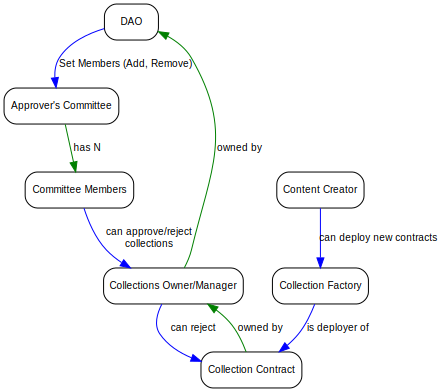
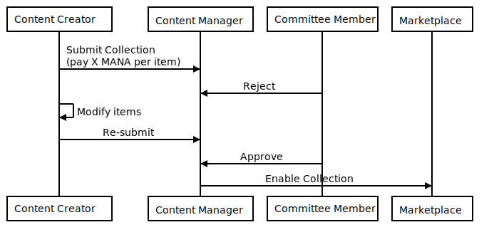

# 2020-11-05 - ADR: Wearable Collection Approval And Economics

## Context and Problem Statement

Decentraland Wearables are a key aspect of the experience. The ability to customize your experience with different wearables and the ability for content creators to come and contribute to the look and feel of Decentraland avatars is key for decentralization.

We currently have a need to add an anti-spam mechanism to the flow; given that the previous designs were not intended to run on L2 and the Ethereum Gas Fees was a high enough barrier to entry.

## Considered Aspects for Approvals & Burning

- A) Approval by committee members

- B) Paying MANA to get reviewed

- C) Staking MANA to issue items

- D) Economic Incentives

## Aspect A: Approval by committee members

The first aspect considered in this proposal is the establishment of a committee of community members with the technical knowledge required to detect and prevent issues with the wearabless anyone creates. These issues include:

- Problems with the 3D mesh, bones, textures or coloring

- Copyright issues

- Incompatibility with other wearables

### Details on the Committee mechanics

- Committee members can be added or removed by the L1 DAO.

- After a collection is submitted to be reviewed, anyone of the committee members can reject it, or approve it. Before approval, the collection will not be available to be bought on the marketplace.

- After rejection, the creator might continue to modify the collection and ask for approval again.

  - There are no extra fees to re-submit.

- Automatically Submit collection to be approved upon deployment of the smart contract.

- There is no special timing or automated approval.

- Requirements on Committee members (automated requirements on committee members to approve/reject)

  - What happens if there is not enough volume? We'll wait and see if this is really a problem.

#### Questions from the meeting (and their answer):

- Do we need a proof of work of the committee in order to keep the "committee member" status?

  - No, we'll play it by ear (if someone doesn't do the work we can vote them out)

- Do the committee members have an incentive to work?

  - We could think about grants, but out of scope for this discussion

- Having a single member of the committee allowed to approve or deny collections, they could be corrupt.

  - We can think about a multisig-like approaches. **Out of scope**

  - If they are corrupt, it would be a governance problem, not software.

- Approved/rejected is only a boolean in the collection: we can revisit decisions later, approvals or rejections may not be final.

  - There are mechanisms in place already to freeze models in case we want to prevent future changes to collections.

  - Members of the committee freeze the collections by submitting a valid content hash

- If we reject a collection we should be able to send feedback.

  - This should be made on the forum. We should implement automated pings and alerts so the committee has to post.

Roles, Contracts, Capabilities (without considering L1/L2 bridges):

<!--
```dot
digraph G {
    rankdir=TB
    graph [fontname = "arial", fontsize="10", color="grey", fontcolor="grey"]
    node [fontname = "arial",fontsize="10", shape="box", style="rounded"]
    edge [fontname = "arial",color="blue", fontcolor="black",fontsize="10"]

    dao [label="DAO"];
    group [label="Approver's Committee"];
    com_member [label="Committee Members"];
    manager [label="Collections Owner/Manager"];
    factory [label="Collection Factory"];
    new_collection [label="Collection Contract"];
    creator [label="Content Creator"];

    group -&gt; com_member [label=" has N" color="green"]
    dao -&gt; group [label=" Set Members (Add, Remove)"]
    manager -&gt; dao [label="  owned by" color="green"]
    com_member -&gt; manager [label=" can approve/reject\n collections"]
    creator -&gt; factory [label=" can deploy new contracts"]
    factory -&gt; new_collection [label= "  is deployer of"]
    new_collection -&gt; manager [label=" owned by", color="green"]
    manager -&gt; new_collection [label=" can reject       "]
}
```
-->



_This graph is illustrative and can vary_

## Aspect B: Paying MANA to get reviewed

Because the Collection Manager and Factory is going to live in L2, the cost to create a large number of collections and send them for approval might be too cheap relative to the cost of the committee to review and make a decision on approving/rejecting these collections.

Thus, we add a demand for content creators to pay the DAO a fee (maybe in the order of magnitude of 1000 MANA) before any committee member can reject it.

Characterstics:

- Any content creator needs to pay X MANA to submit a collection for consideration.

- The proceeds go to the DAO (there would need to be a contract that can only send MANA back to L1)

- The value in MANA is proportional to the number of items in the collection

- For the time being, upon rejection, the creator **no** needs to pay X MANA again

- Committee Members can approve a collection after being rejected

- Re-submission is an off-chain process that can be handled inside the Decentraland forum

_The fee is decided in base of the amount of items in the collection. It may not be affected by the rarity._

#### Sequence Diagram: Manual approval of a collection

<!--
```sequence
Content Creator -&gt; Content Manager: Submit Collection\n(pays X MANA per item)
Committee Member -&gt; Content Manager: Approve
Content Manager -&gt; Marketplace: Enable Collection
```
-->


#### Sequence diagram: Rejection and eventual approval of a collection

<!--
```sequence
Content Creator -&gt; Content Manager: Submit Collection\n(pay X MANA per item)
Committee Member -&gt; Content Manager: Reject
Content Creator -&gt; Content Creator: Modify items
Content Creator -&gt; Content Manager: Re-submit
Committee Member -&gt; Content Manager: Approve
Content Manager -&gt; Marketplace: Enable Collection

```
-->



## Aspect C: Staking MANA to issue items

With the goal of managing items that might become uninteresting over time, or maybe invalid as the platform evolves, this aspect allows owners of an NFT to recover some MANA by burning the items.

- The creation of any new item type (`addItem`) requires a payment in MANA, proportional to its rarity.

  - This proposal only deals with the mechanics, not the policy for price-setting.

  - Having said that, the cost might be inversely proportional to the rarity -- to incentivize more unique items instead of flooding the market with common, uncommon & rare items

- Rationale: Creating new wearables have a cost for the overall community (storage cost for the catalysts, performance of download & memory on the client, indexing on TheGraph, etc).

  > Reevaluate: These prices are here to prevent spammy creation of contracts that impose a tax on performance and resources of the other members of the community.

- After the collection is approved and live, owners of NFTs might burn the token and get a proportinal amount of the staked amount. For example, if I own a Mythic Item that after a couple of years I don't want to use anymore, I might burn it and get 2000 MANA (20,000 / 10 items) back.

- Locking the MANA is already a big financial cost. It would also disincentivize users from creating low-quality items.

- Creators might be able to get loans against future profits of selling these items on the platform.

- One drawback of this aspect is that it sets a floor price for items, which might make it too attractive for users to burn their items and get MANA.

- Another drawback is that these funds need to be kept locked, and they can't be used in the mean time for other things (for example, the DAO could use the funds to provide grants for development of new features)

- Burning an item might be implemented as just "locking" the NFT in the contract, to technically avoid dealing with indexing problems that might arise

#### Questions of the meeting:

- What happens if you burn an item to recover mana and by doing so, it changes its rarity?

  - "Burned" items may be reissued. The items are locked in the contract and it _may_ be possible to re-issue the item by staking MANA.

  - Nacho: You can mint 10 legendary items to yourself. "Burn" 9 of them, and then keep the remaining one, affecting its value.

    - In that case the rarity won't change, because "burn" doesn't acctualy destroys the tokens.

- Can we parametrize this initiative?

  - Most of the values may change with time and depending on the state of the creators.

## Aspect D: Economic Incentives

This proposal has some bad incentives for creators that might not be able to meet the financial requirements to submit a collection. Given that they already have skin in the game because of their dedication and technical work provided, we need some way to re-encourage participation for the issuance of items.

### Alternative: Grants

Content creators might submit a proposal to the DAO/Forum requesting for a "Grant to create a collection". Thus, the creator can receive an amount of MANA as a grant that allows them to create a collection, add items to it, and go through the approval process without the financial burden imposed by the submission fees and staking required.

### Alternative: Licenses

- The creators submit proposals to the DAO/Forum requesting for licences to create a collection. Licences are

allowances on-chain for Ethereum addresses to deploy a collection (1 licence = 1 collection).

This way, the community or the committe will decide beforehand.

- Drawback: We still need a committee to pause/resume collections because there is no way on-chain to prevent the creator/collaborator of a collection to submit a broken model.

- Drawback: Increase the friction even before using the collection creators tool.

## Decision Outcome Per Aspect

- Approval by committee members: **approved** ✅

- Paying MANA to get reviewed: **approved** ✅

  - Every rarity has its own price (DAO can vote price): **approved** ✅

- Staking MANA to issue items: **rejected/deferred** 🛑

  - We should have a mechanism to stop the current collection deployment to switch to new ones ✅

- Economic Incentives: **rejected/deferred** 🛑

## Open Questions

- What is the economic incentive of the committee?

  - We can manage it off-chain, we may not be ready to decide on it to encode it in a smart contract.

- Can the propsal happens on L2 or off-chain for the Alternative D?

  - We are not going to have a voting system en L2, but we can check further implementation of Snapshots with on-chain execution.

- Deployment roadmap

  - How can we deploy this in gradual steps to reduce deployment risks

- How will this look like from an UX standpoint?

  - Marketplace UI to show which items are burn-able

## Participants

- Agustin Mendez

- Ignacio Mazzara

- Agustin Ferreira

- Esteban Ordano

- Federico Molina

- Nicolas Santangelo

- Martin Shibuya

- Marcelo Alaniz

- Juan Cazala

---
