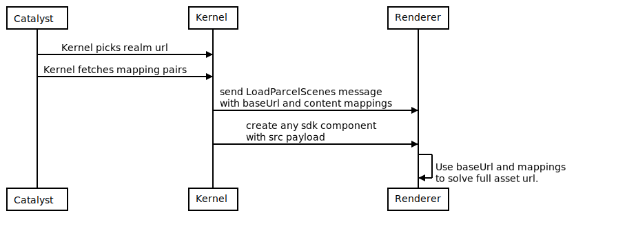
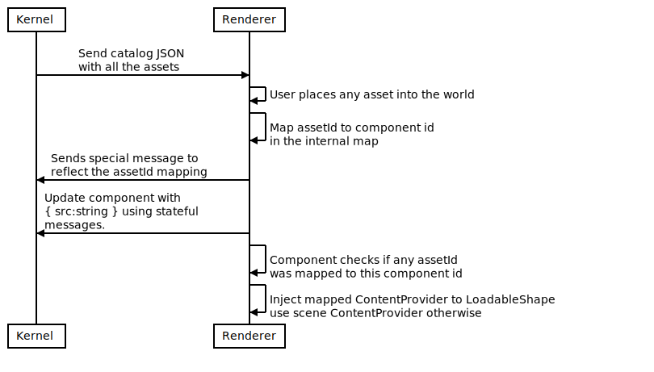

# ADR-18 - Content mappings flow for explorer and builder in-world

## Context and Problem Statement

In explorer, most of the world assets are resolved using the following elements:

#### Base url

The content server URL. This will be always the first part of the resolved URL for downloading the asset. 

Examples:

`https://peer.decentraland.org/contents/`

#### Local asset path

The local relative path pointing to the folder in which the asset was originally stored SDK side.

This relative path is also used internally to resolve references between a GLTF file and its textures. Internally, the GLTF file will store those relative paths, so we have to map them so a valid hash at import time. More on this will be explained later.

Examples can include: `asset.gltf` `assets/cube.glb` `assets/cube.png` etc.

#### Asset Hash

The hash used for composing the full url. This hash is usually assigned by the catalyst content server, and is guaranteed to be unique per individual asset.

Any full asset url may look like e.g.: `https://peer.decentraland.org/contents/QmHash`

### Content mappings and scene flow

When a new scene is created, a message is sent from Kernel to Renderer specifying the data that's going to be needed to assemble a full asset url from a single local asset path. The data looks roughly like this:
```
{
    // Here the value can vary depending on the connected realm
    "baseUrl":"https://peer.decentraland.org/contents",

    "contents":
    {
        "asset.gltf":"QmHash1",
        "asset.png":"QmHash2",
        "weapons/firearm1.gltf":"QmHash3"
    } 
}
``` 

This data is stored in a `ContentProvider` object [(see code).](https://github.com/decentraland/explorer/blob/b1545f8ae65d8e1198caeb18086fcde1d0be20f3/unity-client/Assets/Scripts/MainScripts/DCL/Controllers/Scene/ContentProvider/ContentProvider.cs#L9)

Then, further down the line, a component can be sent with a payload that looks like this:
```
{
    "src":"asset.gltf"
}
```

In runtime we can receive this payload for any scene object. In order to download the object, we must resolve the full URL for it, like this:
```
baseUrl + resolved hash
```
The resolved hash is obtained querying a dictionary with the local asset path. 

This dictionary is scoped to the scene. Meaning that any scene will have a specific dictionary of content mapping pairs and a determined `baseUrl`. The mapping pairs and the baseUrl are fetched from Kernel using our catalyst scene endpoints and then passed over to explorer's renderer.


<!--
```sequence
Catalyst->Kernel: Kernel picks realm url
Catalyst->Kernel: Kernel fetches mapping pairs
Kernel->Renderer: send LoadParcelScenes message\nwith baseUrl and content mappings
Kernel->Renderer: create any sdk component\nwith src payload
Renderer->Renderer: Use baseUrl and mappings\nto solve full asset url.
```
!-->

This approach works fine for most of the cases. However, some issues can be observed:

1) For big scenes, a pretty big content mappings payload have to be sent over to Renderer. This can produce performance hiccups.

2) For content coming from dynamic and user made sources (i.e.: builder or builder in world) the chance of local asset path collisions is very high.

3) For the builder in-world feature we need to update the mappings in real time, and currently we don't have a nice mechanism of doing that without sending the monolithic mappings message scoped to the scene. Also, see (2).

In this document we are going to review the decided approach for dealing with those issues in short and long term stages.

## Considered Options

* Use `UpdateParcelsScene` message for updating mappings.
* Use alternative components to deal with the builder in-world requirements.
* For the builder in-world, add an additional message that binds a component to a specific mappings provider.
* Migrate all our pipeline to use a more robust asset catalog approach, like the one used by Builder.

### Use `UpdateParcelsScene` message for updating mappings

#### Overview
In this approach, we can re-use the existing `UpdateParcelScenes` message with a complete mappings payload to update the existing mappings for the scene. 

This approach don't solve any of the presented issues (1) (2) (3). However, it can enable the correct resolution of mappings for dynamically added assets. 

The local asset path collision will be a possibility, hiccups will persist and made more prominent with the builder in-world. This will happen because in the multiplayer experience, the assets are going to be updated more often. 

A redesign of the approach is _still_ going to be needed to support custom user-made assets. So we are going to be back to square one more sooner than later.

### Use alternative components to deal with the builder in-world requirements

#### Overview
Here, a duplicate component of the existing ones will be created solely for the purpose of supporting the needs of the builder in-world feature.

The idea is that we have a catalog data store that's going to contain all the builder in-world assets. Then, the alternate component will resolve its assets using the catalog instead of the scene mappings data. 

With this, we are effectively addressing (2) and (3).

The issue of this approach is first a violation of the DRY principle, and technical debt will be generated. 

However, the idea of having a data store for mappings is a good one, as the builder in-world already has to get the asset catalog from the builder in order to show the asset palette. The idea of using the catalog is going to be carried over to the next considered options.

### For the builder in-world, add an additional message that binds a component to a specific mappings provider

#### Overview

Here, we play with the idea of adding a new message type that's only going to be available in the builder in-world flow. The message will be sent before any component message with a local asset path reference in its payload.

The idea of the asset catalog is back, and we assume the catalog will be sent at the start of the experience with the totality of the assets.

The idea is that the message will _bind_ the component to an specific `assetId` that's going to be used to query the asset catalog. The asset catalog will return the specific `ContentProvider` needed for that component. 

Finally, the `ContentProvider` is going to be used to resolve the local asset path and construct the full url.

We are going to analyze the flow to address the following use cases:

* A given user puts a new asset in a builder-in world stateful scene 
* The builder-in world stateful scene is loaded, and must deliver the state to Unity using SDK messages.

#### Flow #1: Stateful scene is loaded

<!--
```sequence
Kernel-&gt;Renderer: Send catalog JSON\nwith all the assets
Renderer-&gt;Renderer: Maps json info to &lt;assetId, ContentProvider&gt;
Kernel-&gt;Kernel: Stateful scene load begins
Kernel-&gt;Renderer: Map assetId to component id\nusing special message
Kernel-&gt;Renderer: Update component
Renderer-&gt;Renderer: Component checks if any assetId\nwas mapped to this component id
Renderer-&gt;Renderer: Inject mapped ContentProvider to LoadableShape\nuse scene ContentProvider otherwise
```
-->


#### Flow #2: Any user puts an asset, and the state has to be delivered to the stateful scene

<!--
```sequence
Kernel-&gt;Renderer: Send catalog JSON\nwith all the assets
Renderer-&gt;Renderer: User places any asset into the world
Renderer-&gt;Renderer: Map assetId to component id\nin the internal map
Renderer-&gt;Kernel: Sends special message to\nreflect the assetId mapping
Renderer-&gt;Kernel: Update component with\n{ src:string } using stateful\nmessages.
Renderer-&gt;Renderer: Component checks if any assetId\nwas mapped to this component id
Renderer-&gt;Renderer: Inject mapped ContentProvider to LoadableShape\nuse scene ContentProvider otherwise
```
-->


Code mock-up of how the integration is going to look like in `LoadableShape` code:
```csharp
// Catalog will fill this dictionary. 
// We can have a specialized catalog class for this responsibility.
private static Dictionary<string, ContentProvider> assetIds;

// Special message will fill-up this dictionary
private static Dictionary<string, string> componentToAssetId;

protected virtual void AttachShape(DecentralandEntity entity)
{
    ContentProvider provider;

    if (componentToAssetId.ContainsKey(id))
    {
        provider = assetIds[componentToAssetId[id]];
    }
    else
    {
        provider = scene.contentProvider;
    }

```

This would solve (2) and (3). Trying to solve (1) would involve a re-design of this decision, as we are adding a new message, and this will clash with the scene workers messaging specs.

Here it was discussed about having a monolithic asset catalog message. The monolithic message approach can work in short term, but as new assets are started to be added with the community, this catalog message payload can grow to an unmanageable size. Also, this is already started to happen with our wearables specifications. 

### Migrate all our pipeline to use a more robust asset catalog approach, like the one used by Builder

#### Overview

* Have an asset catalog Kernel<>Renderer messaging pipeline for adding and removing assets lazily as needed.
* Make all our components receive `assetId` references that are going to be mapped to this catalog to retrieve the proper `ContentProvider` and solve our asset urls.
* Our `LoadParcelScenes` flow will no longer provide the mappings. All the asset ids management responsibilities are  going to come from the asset catalog flow.

This is arguably the best solution in terms of solving (1) (2) and (3). However, the refactor cost is high. We would have to adapt all the components to this new approach and re-design the LoadParcelScenes message.

We can split this approach in different stages.

#### Stage 1: MVP for builder in-world

* Add an optional `assetId` to `GLTFShape` payload.
* Add basic messages of the catalog flow for adding/removing assets.
* If the `assetId` field is not empty, the catalog will be queried for the proper `ContentProvider`
* If the `assetId` field is missing, the scene mappings will be used. This will keep the `LoadParcelScenes` flow compatibility.

Example code:
```csharp
public new class Model : BaseShape.Model
{
    public string src;
    public string assetId;
}

...

protected virtual void AttachShape(DecentralandEntity entity)
{
    ContentProvider provider;

    if (!string.IsNullOrEmpty(model.assetId))
    {
        provider = AssetCatalog.GetContentProviderForId(model.assetId);
    }
    else
    {
        provider = scene.contentProvider; // Keep compatibility with the SDK approach
    }
```

This first stage will address (2) and (3) and pave the way for a solution that address (1) in the future.

#### Stage 2: Full approach

* Add `assetId` for all components with a `src` field.
* All components will use this `assetId` to query the catalog
* Mappings are going to be removed from `LoadParcelScenes` message.
* For SDK mode: If any component needs an unknown local asset path, kernel will be queried for it using fast messages (i.e. native). This will be needed for the local paths referenced inside GLTFs. In a normal user made scene, we don't know the GLTF references until we import it.
* For builder in-world mode: The catalog will be populated on advance, so no queries will be needed. This is because the asset catalog already has the proper dependency information.

In the stage two, we build upon the first stage, and unify the asset catalog approach so its used widely in our SDK code path too. This will reduce the complexity of the flow, making it easier to maintain, and solve (1). 

## Decision Outcome

The outcome is to advance on the Stage 1 of the **robust asset catalog approach**. 

We argue that this approach has the best return of investment, because: 

* Stage 1 task size is about the same compared with the other options discussed.
* Stage 1 gives a clear roadmap on improving the system scalability while keeping tabs on simplicity for Stage 2. 
* Reaching Stage 2 will solve all the presented issues. 

## Participants

- Nico Chamo
- Brian Amadori
