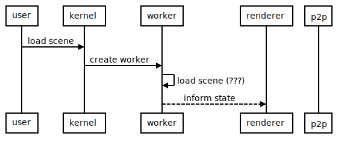

# State sync for builder-in-world

## Context and Problem Statement

We need to find a sustainable path to develop the builder in world without compromising future plans and also enabling experimenting with the static scene definition initiatives and new SDK.

The domain of the problem can be divided in three big chunks:

* State management

* Synchronization

* Behavior

Today we are deciding on the State management.

## Options

### Option 1 - Renderer owns the state

In this approach the owner of the "edited" state is the renderer.

#### Initial load

<!--
```sequence
participant user
participant kernel
participant worker
participant renderer
participant p2p

user-&gt;kernel: load scene
kernel-&gt;worker: create worker
worker-&gt;worker: load scene (???)
worker--&gt;renderer: inform state
```
-->


#### Initial scene loading (while others are editing)

<!--
```sequence
participant user
participant kernel
participant worker
participant renderer
participant p2p


p2p--&gt;kernel: edition beacon {scene xy}
kernel--&gt;renderer: edition mode
renderer--&gt;worker: kill worker

p2p--&gt;renderer: process update
user-&gt;renderer: perform changes (if allowed)
p2p--&gt;renderer: process update
```
-->


#### Save state

Save the current snapshot of the static scene

<!--
```sequence
user--&gt;renderer: edition mode
renderer--&gt;worker: kill worker
user-&gt;renderer: perform changes
renderer-&gt;renderer: process changes 🔧
user-&gt;renderer: save
renderer-&gt;kernel: save {serialized state}
kernel-&gt;builder_server: generate code and store
```
-->


#### Broadcast updates

After a change in state (i.e. builder action)

<!--
```sequence
user--&gt;renderer: edition mode
renderer--&gt;worker: kill worker
user-&gt;renderer: perform changes
user-&gt;renderer:
user-&gt;renderer:
renderer-&gt;renderer: process changes 🔧
renderer--&gt;p2p: update-msg
```
-->


#### Receive updates

From other connected scenes.

In this case we would receive updates only on edition mode.

<!--
```sequence
user--&gt;renderer: enter edition mode
renderer--&gt;worker: kill worker
p2p--&gt;renderer: update-msg
renderer-&gt;renderer: process changes 🔧
```
-->


#### Open questions

* Do we want to have a back and forward edition from builder and builder in world?

---

### Option 2 - Scene owns the state

In this approach, the scene code is owner of the state at all times.  

#### Initial load

<!--
```sequence
participant user
participant kernel
participant worker
participant renderer
participant p2p

user-&gt;kernel: load scene
kernel-&gt;worker: create worker
worker-&gt;worker: load scene (JSON)
worker--&gt;renderer: inform state

worker-&gt;worker: connect to synchronization bus
worker-&gt;kernel: init p2p bus
```
-->


#### Receive updates

From other connected scenes.

In this case we would receive updates either we are editing or not.

<!--
```sequence
participant user
participant kernel
participant worker
participant renderer
participant p2p

p2p--&gt;worker: update-msg

worker-&gt;worker: process changes 🔧
worker--&gt;renderer: inform state
```
-->


#### Broadcast updates (v0)

After a change in state (i.e. builder action)

<!--
```sequence
participant user
participant renderer
participant worker
participant p2p
participant kernel


user-&gt;renderer: perform changes


renderer--&gt;p2p: broadcast update-msg
renderer-&gt;worker: update-msg
worker-&gt;worker: process changes 🔧
```
-->


#### Broadcast updates (v1)

After a change in state (i.e. builder action)

<!--
```sequence
participant user
participant renderer
participant worker
participant p2p
participant kernel


user-&gt;renderer: perform changes

renderer-&gt;worker: update-msg
worker-&gt;worker: process changes 🔧
worker--&gt;p2p: broadcast update-msg
```
-->


#### Save state

Save the current snapshot of the static scene

<!--
```sequence
participant user
participant renderer
participant worker
participant p2p
participant kernel

user-&gt;renderer: save state
renderer-&gt;worker: save

worker-&gt;worker: serialize scene
worker-&gt;worker: save JSON (POST?)
```
-->


### Option 3 - new worker owns the state

<!--
```sequence
user-&gt;worker: kill worker
user-&gt;new_worker: create for edition (scene xy)
new_worker-&gt;content_server: get JSON (scene xy)
content_server-&gt;new_worker: 
new_worker-&gt;renderer: initial state 
renderer--&gt;new_worker: update-msg
renderer--&gt;p2p: update-msg (for broadcast)
p2p--&gt;new_worker: update-msg
```
-->


## Decision Outcome

#### Alternative 1

* Kill worker solution

* We are able to play and stop the scene from the builder in world.

* Requires code generation

* Synchronization is handled by kernel/renderer

* Publish is still an irreversible process

#### Alternative 2

* Keep worker & stop systems

* Delay builder in world until synchronization works (requires work on new SDK)

* We can't go on this alternative until smart items are component based (not code-gen)

* End goal, but it has so much constraints right now

#### Alternative 3 ✅

* Like alt 1 but creating new worker for syncing instead of using kernel/renderer

* Seems like a nice decoupling of new SDK vs existing/old

* Can work as a foundation for new runtime

# Participants

- Nicolas Chamo

- Pablo de Haro

- Esteban Ordano

- Agustin Mendez

Date: 2020-10-06