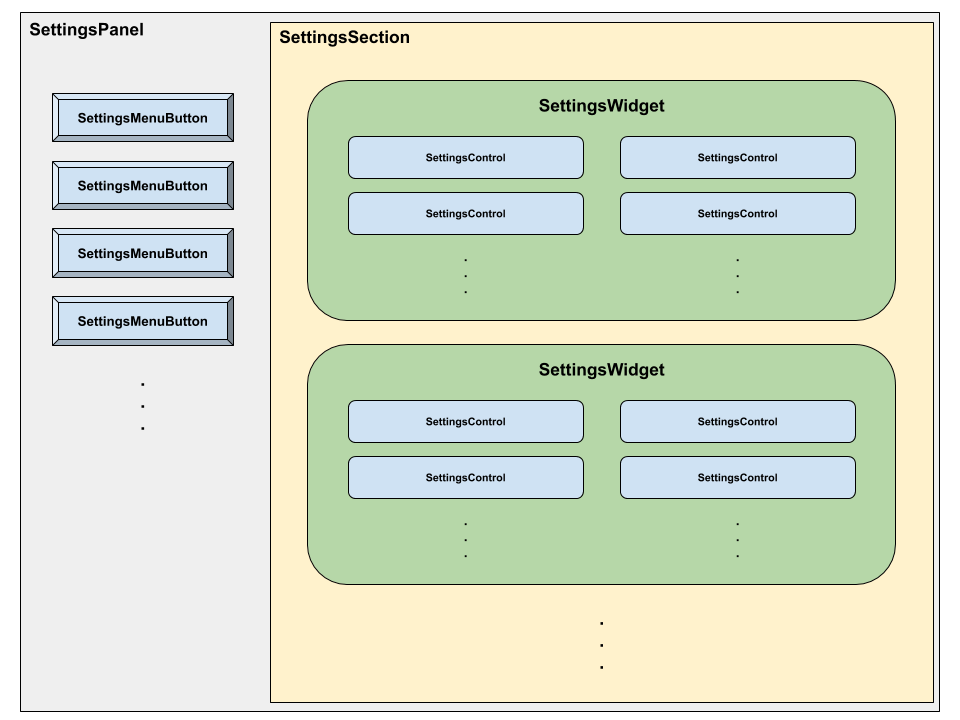
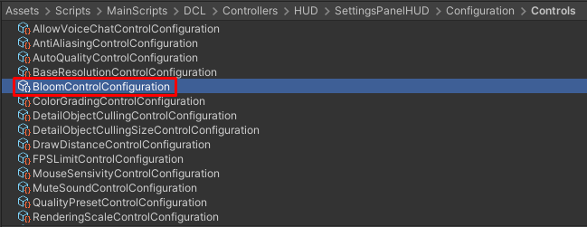

# Explorer Settings Panel Architecture

## Motivation
The idea is to replace the implementation of the old `SettingsHUD` with a new architecture based on 4 independent concepts: **Panel**, **Sections**, **Widgets** and **Controls**.

- There will only exists one `PANEL` and will contain one or more `SECTIONS`.
- A `SECTION` will contain one or more `WIDGETS`.
- A `WIDGET` will contain one or more `CONTROLS`.

This new philosophy would lead to the following advantages:

- Making it easier to create new settings into the HUD.
- Making it easier to change the sorting of the settings in the HUD.
- Making it easier to test the different settings features.
- Standardizing the implementation of all settings and make the code scalable and easier to understand.

## Approach
The new Settings ecosystem is divided into the modules defined in the next example image:



## Modules

### DCL.SettingsPanelHUD.Panel
There will be only one `PANEL` module (it will be the own `SettingsPanelHUD`) and will represent the container for all the `SECTIONS` that will exist as children.

#### Responsibilities
- Instantiate and configure all the menu buttons (as a vertical layout) into the HUD menu.
- Instantiate all the `SECTION` associated with each menu button.
- Manage the visibility of the `SECTIONS`.

### Main classes
-   **SettingsPanelModel** : ScriptableObject
-   **SettingsPanelHUDView** : MonoBehaviour
- **SettingsPanelHUDController** : IHUD, ISettingsPanelHUDController
- **ISettingsPanelHUDController**

### DCL.SettingsPanelHUD.Sections
There could be several `SECTION` modules and will represent the container for all the `WIDGETS` that will exist as children.

#### Responsibilities
- Instantiate all the `WIDGETS` (as a vertical layout) into each `SECTION`.

#### Main classes
- **SettingsSectionModel** : ScriptableObject
- **SettingsButtonEntry** : MonoBehaviour
- **SettingsSectionView** : MonoBehaviour, ISettingsSectionView
- **ISettingsSectionView**
- **SettingsSectionController** : ScriptableObject, ISettingsSectionController
- **ISettingsSectionController**

### DCL.SettingsPanelHUD.Widgets
There could be several `WIDGET` modules and will represent the container for all the `CONTROLS` modules that will exist as children.

#### Responsibilities
- Instantiate and initialize all the `CONTROLS` (in several vertical layouts) into each `WIDGET`.

#### Main classes
-   **SettingsWidgetModel** : ScriptableObject
- **SettingsWidgetView** : MonoBehaviour, ISettingsWidgetView
- **ISettingsSectionView**
- **SettingsWidgetController** : ScriptableObject, ISettingsWidgetController
-   **ISettingsWidgetController**

### DCL.SettingsPanelHUD.Controls
There could be several `CONTROL` modules and will represent the implementations of each specific setting (for example: a slider for a volume, a checkbox for activate/deactivate some option, etc.).

#### Responsibilities
- Execute the specific logic of each settings control.

#### Main classes
-   **SettingsControlModel** : ScriptableObject
- **SettingsControlView** : MonoBehaviour, ISettingsControlView
- **ISettingsControlView**
- **SettingsControlController** : ScriptableObject

## Configuration for the end-user
Finally the whole configuration of the `SettingsPanelHUD` involves the next Scriptable Objects:

### Settings Panel configuration SO (only one asset)
It includes a list of `SECTIONS` (represented by the “SettingsSectionModel” model) that will be part of the settings main panel. These `SECTIONS` will be automatically instantiated into the HUD at the beginning of its life-cycle.

### Sections configuration SO’s (there may be several asset)
It includes all the needed information for a `SECTION` and a list of `WIDGETS` (represented by the “SettingsWidgetModel” model) that will be part of this `SECTION`. These widgets will be automatically instantiated into the HUD at the beginning of its life-cycle.

### Widget configuration SO’s (there may be several asset)
It includes all the needed information for a `WIDGET` and a list of `CONTROLS` (represented by the “SettingsControlModel” model) that will be part of this `WIDGET`. These `CONTROLS` will be automatically instantiated into the HUD at the beginning of its life-cycle.

### Control configuration SO’s (there may be several asset)
It includes all the needed information for a `CONTROL`.

## UML Diagram


## Benefit
The main benefits of this architecture are:

-   We will be able to develop settings `CONTROLS` faster.
- We will be able to change the sorting of each configuration module without the dependency of the art team and without the necessity of changing any visual prefab, because all the configurations are embedded in serialized assets (Scriptable Objects)
- It will be easier to test each setting feature in an independent way.
- The system is scalable and flexible enough for future changes in the HUD.

## How To: Add a new settings control in the HUD

### 1. Create the specific controller
- Go to the folder `Assets\Scripts\MainScripts\DCL\Controllers\Settings\SettingsControllers\SpecificControllers` and create a new controller class called `{control name}ControlController`.
- Make the class inherit from `SettingsControlController`.
- Add the header `[CreateAssetMenu(menuName = "Settings/Controllers/Controls/{control name}", fileName = "{control name}ControlController")]`.
- Override the next mandatory methods from `SettingsControlController`:
	- `object GetStoredValue()`: It should return the stored value of the control. The return value should be a bool (for toggle controls), a float (for slider controls) or an int (for spin-box controls).
	- `void UpdateSetting(object newValue)`: It should contain the specific logic for the settings control that will be triggered when the its state changes. The received `newValue` is the new state and can be a bool (for toggle controls), a float (for slider controls) or an int (for spin-box controls).
- If you neeed it, you can also override these other optional methods from `SettingsControlController`:
    - `void Initialize(ISettingsControlView settingsControlView)`: This is the place where you will be able to initialize anything you need for the control behaviour.
    - `void OnDestroy()`: The logic put here will be triggered when the control is destroyed.
- Available fields that you can use from `SettingsControlController`:
    - `currentGeneralSettings`: This field will access to the general settings currently stored in the `Setting` singleton class.
    - `currentQualitySetting`: This field will access to the quality settings currently stored in the `Setting` singleton class.

#### Example
```csharp
using DCL.SettingsController;
using UnityEngine;
using UnityEngine.Rendering.Universal;

namespace DCL.SettingsControls
{
    [CreateAssetMenu(menuName = "Settings/Controllers/Controls/Bloom", fileName = "BloomControlController")]
    public class BloomControlController : ToggleSettingsControlController
    {
        public override object GetStoredValue()
        {
            return currentQualitySetting.bloom;
        }

        public override void UpdateSetting(object newValue)
        {
            // Code related to store the setting value in our Settings class
            currentQualitySetting.bloom = (bool)newValue;

            // Code related to apply the setting
            if (QualitySettingsReferences.i.postProcessVolume)
            {
                if (QualitySettingsReferences.i.postProcessVolume.profile.TryGet<Bloom>(out Bloom bloom))
                {
                    bloom.active = currentQualitySetting.bloom;
                }
            }
        }
    }
}
```
### 2. Serialize the new controller
- Go to the folder `SettingsPanelHUD\Resources\Controls`.
- Open the menu `Assets -> Create -> Settings -> Controllers -> Controls` and choose your new controller created.
- Put a name to the created asset: `{control name}ControlController`.


### 3. Create the configuration asset of the control
- Go to the folder `SettingsPanelHUD\Configuration\Controls`.
- Open the menu `Assets -> Create -> Settings -> Configuration -> Controls` and choose one of the available type of controls: Toggle, Slider or Spin-Box.
- Put a name to the created asset: `{control name}ControlConfiguration`.
- Configure the asset with all the needed info for the new control (title, view, controller, etc.)




### 4. Add the new control to the Settings Panel
- Go to the folder `SettingsPanelHUD\Configuration\Widgets`.
- Select the `WIDGET` where you want to put the new control.
- Add the configuration asset created in the step 3 in the column where you prefeer.


And it is all! When you run the application, you will notice that the `SettingsPanelHUD` will have created your new control  in the correct place.

**NOTE**: For more examples of controls, you can take a look to all the controllers that we currently have in the folder `Assets\Scripts\MainScripts\DCL\Controllers\Settings\SettingsControllers\SpecificControllers`.

##  Participants
Date: 2020-12-11
- Santi Andrade