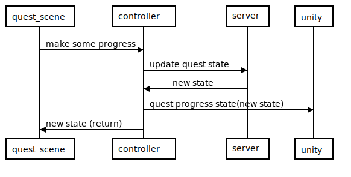
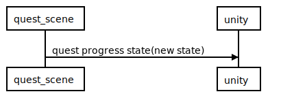

# 2021-01-19 - Quests Progress UI

## Context and Problem Statement

How to render the Quests progression?

Based on the context of a previous meeting with Pravus, Alex, Pablo, Marcosnc and Mendez on Jan 7, 2021:

## Portable experiences & quests

### How do we integrate quests with portable experiences?

- Unity should uniformly render all quests' progression in the same way.

- Every quest is a regular scene that runs in a "global" scene. "global" means without limits of parcels.

#### The quest (the SDK scene running the logic and visible part of the quest)

- The quest' scene will use an SDK `QuestTrackingInformation(steps & progression)` primitive to consistently render the quest UI

- The quest' scene will handle the execution of the logic of the quest

- The progression of the quest will have to be saved and loaded from the quest'scene

## Considered Options

## Option A

- `quest_scene` is the scene running the quest. It can be either a global scene (PE) or a regular LAND scene.

- `controller` is the quests controller in kernel, it transparently handles the interaction with the quests server.

<!--
```sequence
quest_scene-&gt;controller: make some progress
controller-&gt;server: update quest state
server-&gt;controller: new state
controller-&gt;unity: quest progress state(new state)
controller-&gt;quest_scene: new state (return)
```
-->



- In this scenario, special code would have to be put in place to send the messages to unity in behalf of the scene and update the state from the quests server.
- Quests UI will be always limited by our server, which points the implementation in a centralized direction.


## Option B

- `quest_scene` is the scene running the quest. It can be either a global scene (PE) or a regular LAND scene.

- `controller` is the quests controller in kernel, it transparently handles the interaction with the quests server.

<!--
```sequence
quest_scene-&gt;controller: make some progress
controller-&gt;server: update quest state
server-&gt;controller: new state
controller-&gt;quest_scene: new state (return)
quest_scene-&gt;unity: quest progress state(new state)
```
-->


It enables us to test the UI without interacting with the controller or the scene:

<!--
```sequence
quest_scene-&gt;unity: quest progress state(new state)
```
-->



- It also allows any scene to show quests progression, enabling developers to perform their own quests in their LAND or wearables.
- In this scenario, the quests state would be sent to unity using an SDK component, leveraging our current messaging structure. It can be attached to the `engine.rootEntity` to not treat it differently than other components.
- Quests UI will be decoupled from the quests controller and quests server, aligning the implementation with our decentralization objectives (by removing a requirement of a centralized server).
- Even though it is relly useful to test and debug quests, more limitations can be set in place for production mode.

## Implementation details

The renderer will receive an entity with a component of the type `QuestTrackingInformation(data)`. Based on that component, the renderer will have custom logic to render the component following the UX designs.

Since the component will be tied to an entity, once the entity is removed from the engine the UI will disappear.

UI for quests is different than UI for the rest of the SDK, it has few customization options and it doesn't dissapear if you leave the boundaries of the scene. This is so, to enable a better experience with quests _and_ because the UI/UX designs also offer a way to close the individual UIs.

## Decision Outcome

We choose B because it enables us to render the quests UI without coupling the quests controller and therefore, the server. Also positions Decentraland in a more decentralized path by making centralized servers not required to access the features.

Anyone could now implement their own custom Quests servers without asking permission or having the platform as a limitation.

## Participants

- Mendez
