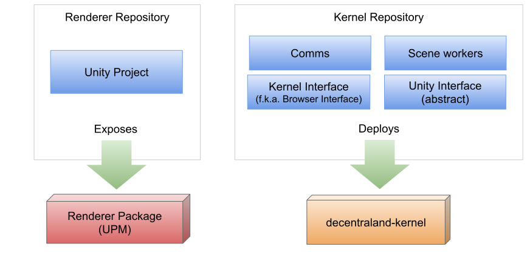
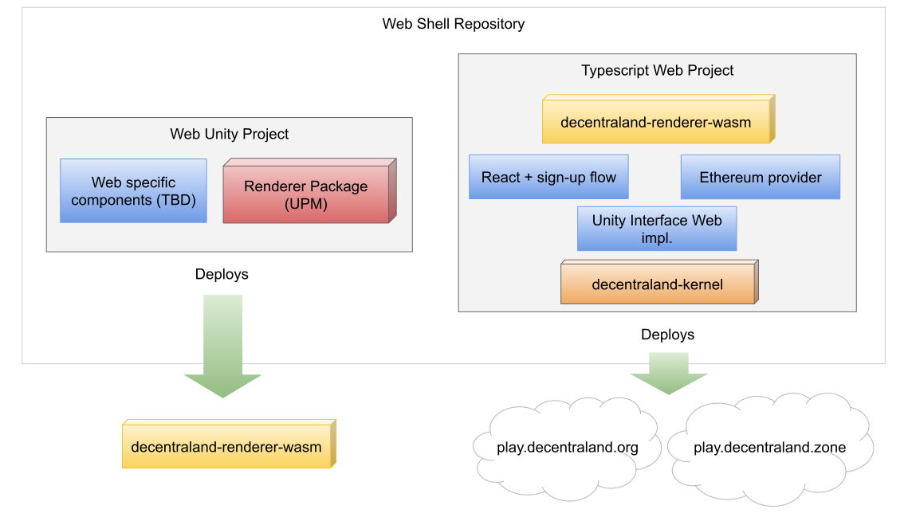
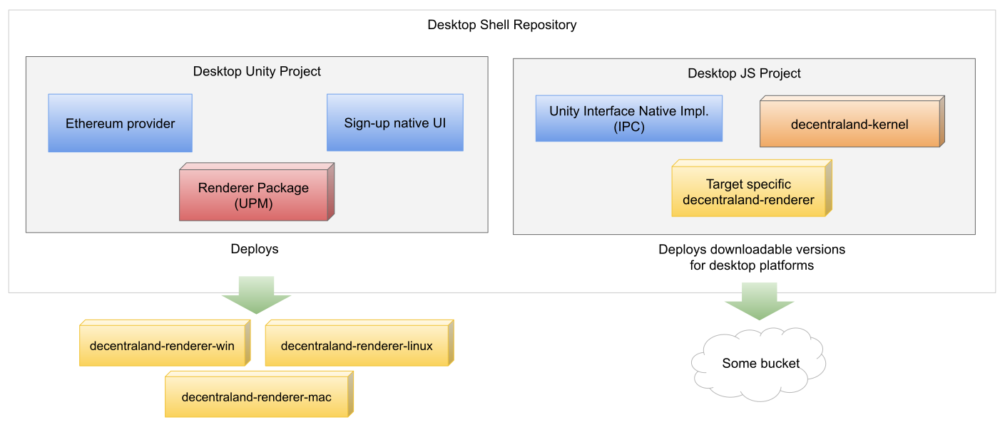

# ADR-25 - explorer repositories decoupling

## Abstract

We are planning to support desktop clients along with the web implementation, and currently our codebase is tightly coupled to the browsers.

When aiming for different platforms we face new development streamlines and independent release lifecycles. Also, code duplication should be minimized. 

With those constraints in mind, this document proposes the initial steps towards a project reorganization that fulfill those needs. 

## Need

* Reaching a project structure that easily enables cross-platform development for Explorer minimizing duplication of code.

* This structure should allow individual development lifecycles (SDLC) for each platform.

* As this project is beginning to scale, we are going to need more contributors. If Unity’s project is easier to set up onboarding will be faster and collaboration encouraged. 

## Approach

To truly enable cross platform development, all the platform-specific code should be separated from the generic business logic. Currently, the Kernel and Unity codebases are tightly coupled to the fact we are targeting browsers. Initial efforts were made with the `Website` component, but currently this component build system and internal logic is tightly coupled to Kernel.

Also, our current web3 ethereum provider isn’t properly decoupled from the project. When targeting desktop platforms, we have the need to use a specialized ethereum provider.

If we have Kernel and Unity as platform agnostic components, the concept of platform-specific shells is enabled. Each shell will have the responsibility of instancing and adding the glue for each component for the target platform.

By going for this approach, supporting new platforms will be just a matter of building new shell repositories that instance specific components. As these shells will have their own CI/CD pipelines, we can have independent versioning and lines of work for maintaining each project. 

## Architecture Overview

The Explorer repository will end up divided in different repositories:

### Renderer Repository

Contains the current Explorer’s Unity project.

The CI/CD of this repository will output the decentraland-renderer npm package publication to be consumed by the web shell repo (more on this later)

Also, this repository will have its own package.json file. Effectively converting it to a UPM Package that will be consumed by the desktop shell repo (more on this later)

### Kernel Repository

The Kernel repo contains all the typescript code that manages the lifecycle of the worker scenes, comms, SDK glue, etc. 

An important detail is that the Unity Interface will only be contained in abstract form. As different implementations of the Unity Interface will be needed for web and desktop.

The CI/CD of this repository will output a npm package to be consumed by the platform specific shells (more on this later).

### Web Shell Repository (f.k.a. Website)

All the code bound to a web browser is contained exclusively inside this shell, not kernel anymore.

The CI/CD of this repository is going to output internal and production releases for play.decentraland.zone and play.decentraland.org respectively.

* Contains React and the entry point that instantiates Renderer and Kernel. 

* The typescript project will also be responsible for creating the ethereum provider and passing it as a parameter to Kernel.

* The typescript project contains a thin layer with the `unity-interface` and all the code that is directly related with the browser renderer (GIFs, mouse events wrapper, audio, video, etc).

* An independent Unity project contains the Renderer Package, the web specific entry point (InitialScene + Main + etc) and any web specific components that may be needed.

### Desktop Shell Repository

Contains all the components to run a desktop version of Decentraland. 

The CI/CD of this repository is going to be bound to internal and production releases that will be served from a link in the download section of our landing pages (TBD).

* The Unity executable will be run by a native JS virtual machine (i.e. NodeJS) to run the scenes and some parts of the kernel. This will be done via a shell command, and this means two processes will be running by this stage. The JS project will communicate with the Unity process using IPC (Exact definition TBD) or FFI linking. In the future there will be different executables generated for each of the desktop platforms (win, mac, linux).

* A Desktop Unity project containing the renderer’s package and specific platform components (i.e. sign in/sign up screens, terms of service, desktop ethereum provider, any communication glue for the Native JS Project)

* On the Native JS Project, a thin TS layer with the `unity-interface` desktop implementation and all the code that is directly related with the desktop renderer will be included. This implementation will have the specifics of the IPC communication needed.

## Staged plan

* Separate a copy of the explorer repo into a decentraland/renderer repository. Keep Explorer working.

* In isolation, work on the decentraland/renderer repository to make CI work and expose interfaces to be used by kernel in the future.

* After a checkpoint (TBD) start using the new build in decentraland/explorer synchronize changes and delete unity files from the original repository.

* After stable release, repeat the same process to separate website and kernel.

## Benefit

This approach decouples the kernel repository from any business logic tied to the web browsers, moving that part directly to the web shell  repository. It not only enables better testing tools (NodeJS) but it also makes the code more portable, following the objective of reusing parts of the `kernel` in the desktop distribution.

Unity build now has an independent release cycle making the CI and iteration cycle faster. It also enables us to scale the project using modules that can be reused by many implementations of Decentraland. 

Having all the repositories separated will enable faster onboardings to specific areas of the project. Helping not only our new team members but also the open source community. Making local testing an easier task with less dependencies, both for Unity teams and for Kernel teams (goodbye make watch).

Inevitably, some testing helpers would need to be set in place to enable the success of this plan, for instance: a testing entry point in kernel that mocks the website and enables unity devs to execute kernel from the editor and vice versa.

All the repositories would manage their own versioning using semantic versioning to control compatibility.

Protocol changes would require now two PR in different repositories (i.e. kernel and renderer). That is a known issue that was not ignored during the planning of this process. Even though changes in the protocol are less and less common over time, it would require an extra work of coordination and verification.

## Participants

- World Team
- Agus Mendez
