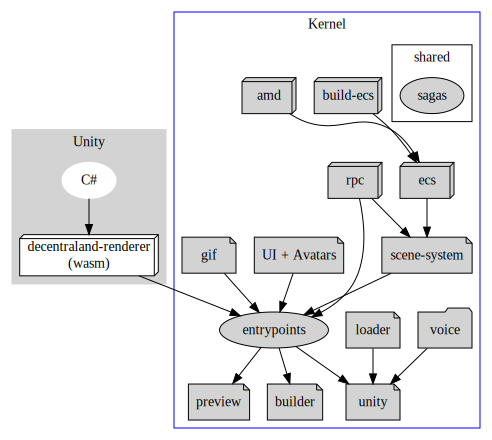
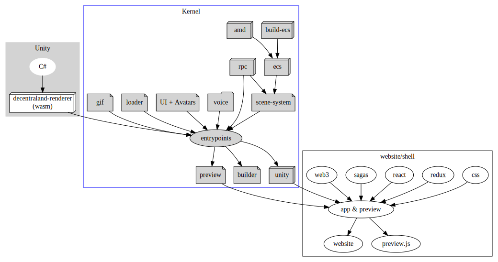

# Explorer packages organization

## Context and Problem Statement

As we grow the functionalities of the explorer, the code complexity grows among with it.

Currently the whole explorer codebase is in the decentraland/explorer repository.

It is roughly divided in two big chunks:

* Unity

* Kernel

<!--
```dot
digraph G {
    subgraph cluster_0 {
        style=filled;
        color=lightgrey;
        node [style=filled,color=white];
        "C#" -&gt; "decentraland-renderer";
        "decentraland-renderer" [label="decentraland-renderer\n(wasm)",shape=box3d,color=black,fillcolor=white];
        label = "Unity";
    }

    subgraph cluster_1 {
        node [style=filled];
        "build-ecs" [shape=box3d];
        amd [shape=box3d];
        "build-ecs" -&gt; ecs;
        amd -&gt; ecs;
        ecs [shape=box3d];
        rpc [shape=box3d];
        voice [shape=folder];

        ui -&gt; entrypoints;
        "loader" -&gt; "unity";
        "gif" -&gt; entrypoints;
        "voice" -&gt; unity;


        // workers
        gif [shape=note];
        "scene-system" [shape=note];
        "scene-system" -&gt; entrypoints;
        loader [shape=note];
        "ui" [shape=note,label="UI + Avatars"];

        subgraph cluster_2 { 
            sagas;
            label=shared;
        }

        ecs -&gt; "scene-system";
        rpc -&gt; "scene-system";
        rpc -&gt; entrypoints;
        "entrypoints" -&gt; "preview" ;
        "entrypoints" -&gt; "builder";
        "entrypoints" -&gt; "unity";
        preview [shape=note];
        unity [shape=note];
        builder [shape=note];
        label = "Kernel";
        color=blue
    }

    "decentraland-renderer" -&gt; "entrypoints";
}
```
-->


## Considered Options

Create a new top-level directory named "website" or "shell" in the explorer repository and slowly start moving browser specific code to it.

<!--
```dot
digraph G {

        subgraph cluster_0 {
            style=filled;
            color=lightgrey;
            node [style=filled,color=white];
            "C#" -&gt; "decentraland-renderer";
            "decentraland-renderer" [label="decentraland-renderer\n(wasm)",shape=box3d,color=black,fillcolor=white];
            label = "Unity";
        }
    subgraph cluster_1 {


        node [style=filled];
        "build-ecs" [shape=box3d];
        amd [shape=box3d];
        "build-ecs" -&gt; ecs;
        amd -&gt; ecs;
        ecs [shape=box3d];
        rpc [shape=box3d];
        voice [shape=folder];

        ui -&gt; entrypoints;
        "loader" -&gt; entrypoints;
        "gif" -&gt; entrypoints;
        "voice" -&gt; entrypoints;


        // workers
        gif [shape=note];
        "scene-system" [shape=note];
        "scene-system" -&gt; entrypoints;
        loader [shape=note];
        "ui" [shape=note,label="UI + Avatars"];


        ecs -&gt; "scene-system";
        rpc -&gt; "scene-system";
        rpc -&gt; entrypoints;
        "entrypoints" -&gt; "preview" ;
        "entrypoints" -&gt; "builder";
        "entrypoints" -&gt; "unity";
        preview [shape=note];
        unity [shape=note,shape=box3d];
        builder [shape=note];
        label = "Kernel";
        color=blue;
    }
    subgraph cluster_3 {

    "decentraland-renderer" -&gt; "entrypoints";

    css-&gt;app;   
    redux-&gt;app;
    react-&gt;app;
    sagas-&gt;app;
    web3-&gt;app;
    unity-&gt;app;
    preview-&gt;app;

    app [label="app &amp; preview"];
    app-&gt;"website";
    app-&gt;"preview.js";
        
    label="website/shell";
    }
}
```
-->


## Decision Outcome

Staged execution:

1. Build kernel artifacts and publish to NPM

2. Move react code to new "website" folder continuing consuming files from kernel

3. (future stages) slowly move sagas and browser specific code to the new website/shell folder

## Participants

- Agustin Mendez

- Brian Amadori

- Ezequiel Camino

- Marcos Nuñez Cortés

- Pablo de Haro

Date: 2020-10-08