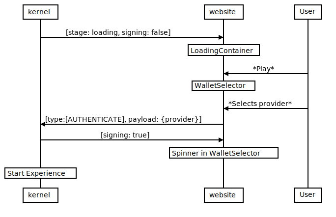
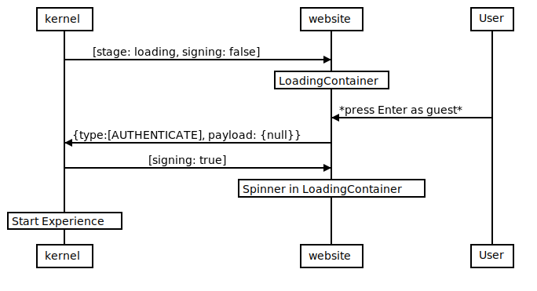

# ADR-31 - Signin/signup Kernel<>Website

# Communication kernel<>website in the signin/signup flow

## Context
An amount of undefined race-conditions were causing crashes when loading the experience while the renderer was not ready. To avoid it we setup a blocking waiting (represented as a spinner) before the signin screen.

## Problem
Users with slow internet connection were experiencing long waiting times without feedback and that was causing some drop-offs.

## Decided Solution
To avoid a regression with the fixed race conditions kernel business logic will maintain all the ensuring renderer yields, but the website will allow the user to start the signin process in the meantime.

## Implementation

### Key Files
- Kernel
  -`session/sagas.ts`
- Website
    - `src/components/auth/LoginContainer.tsx`
    - `src/components/auth/EthLogin.tsx`
    - `src/components/auth/wallet/WalletSelector.tsx`

The current implementation is based on events and data in the global store. Take this into account when reading the diagrams.
An arrow from `kernel` to `websites` doesn't actually means a direct connection between the 2 projects.

The following diagrams represents a high-level view of the system.
### Sign-in
  

### Sign-up
  

## Implementation Details
Our previous implementation enforced the renderer requirement through website by hiding the buttons and not allowing the users to do anything. 

Now `EthLogin.tsx` shows the sign-in buttons by default and listen to changes in the `signin` state to put the spinner. `Kernel` will take care of preventing all the race conditions, if the user sign-in before `renderer` is ready, `Kernel` will yield until it is. The feedback to the user is exactly the same, a spinner, but now we give some buffer time for renderer to start while the user is busy with the signin.

