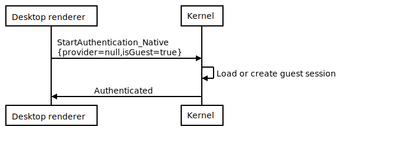

# Communication between Desktop unity and Kernel

## Context and Problem Statement

The desktop client will be executed outside of an internet navigator like Chrome or Firefox, and the `explorer-website` will not be used.

Currently, to log in into the world, you must enter through `explorer-website` (or derived), and the authentication happens with exchanges of messages between `kernel` and `website`.

On Desktop, `website` will not be used, and those exchanges will be with `kernel` and `renderer`. So `explorer-desktop` must implement a way to communicate those to be able to log in.

The problem is how to execute `kernel` without a navigator and communicate it with the `renderer`.

## Considered options

- Launching `kernel` with `Chromium headless`

- Launching `kernel` with `NodeJS`

## Decision outcome

Launching `kernel` with `Chromium headless` is the most compatible with what currently `explorer` has. But executing `kernel` in `NodeJS` is inevitable because it will execute `kernel` unit tests and other cases. Taking advantage of this approach is the best option not to rewrite code and isolate it as much as possible.

Removing `explorer-website` from the Desktop Client Project is required. So the communication with `kernel` and `renderer` to authenticate will be implemented without other options.

# Solution

To implement what it's described above the team decided the following flows:

## Initialization of components


## Guest login flow



## Wallet connect flow (NOT GUEST)


Some pseudo code of how `explorer-website` and `explorer-desktop` will start:
```typescript
// shell=explorer-website (browser)

import Renderer
import Kernel

const kernel = new Kernel({
    renderer: new Renderer()
})

await kernel.authenticate(provider, isGuest=true)
// kernel emits a message to start the renderer

```

```typescript
// shell=explorer-desktop (NodeJS)

import Renderer
import Kernel

const renderer = new WebSocket_Remote_Renderer('ws://localhost:8000')

const kernel = new Kernel({
    renderer
})

renderer.onAuthenticateMessage(message => {
   await kernel.authenticate(message.provider, message.isGuest) 
})

```

# Participants

- Alvaro
- Brian
- Mateo
- Mendez