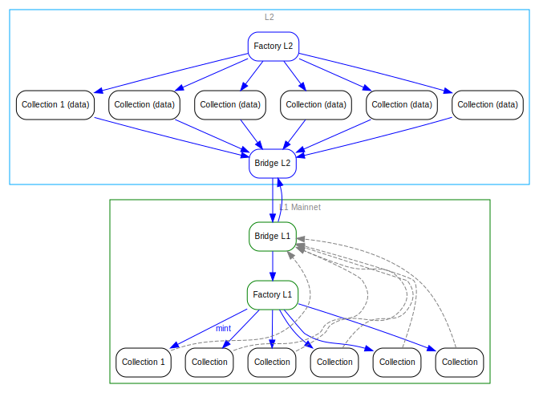
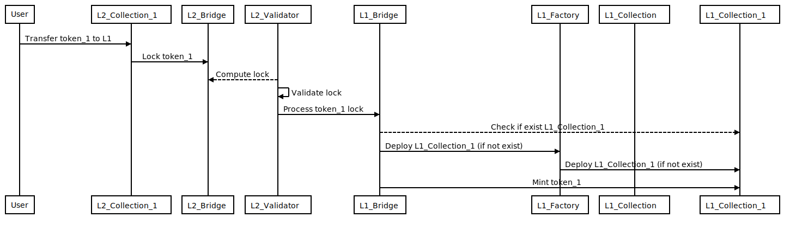
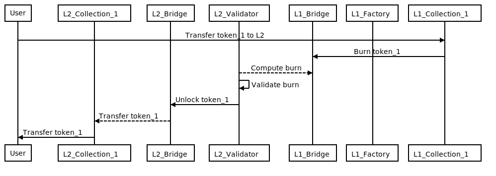
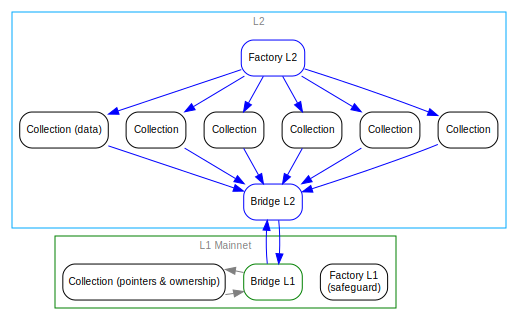
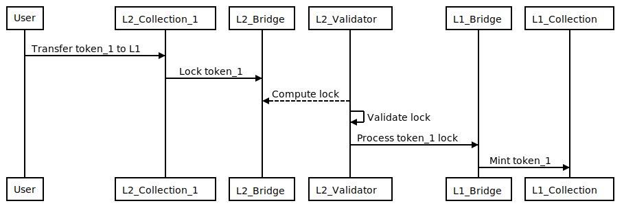
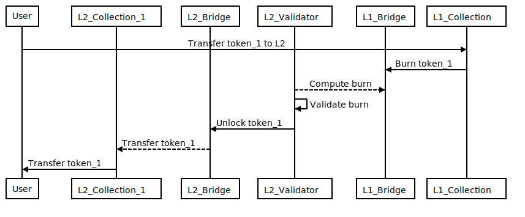

# Collections architecture in L1 & L2

## Context and Problem Statement

Collections will be key in the Decentraland ecosystem. To bring more scalability and reduce costs the L2 will be seen as the main chain, and L1, as the gateway for collectors to use/buy/sell tokens in other platforms.

L1 could be seen as Ethereum mainnet and L2 any other sidechain EVM compatible as Matic or xDai.

Each collection follows the ERC721 standard. Every token transferred between layers will keep a reference of itself in the main chain:

- Collection address in L2. E.g: `0x2dac71c8c8a4b9547b53c1e1838152ca3277ce76`

- Token Id in L2. E.g: `1`

- Token URI in L2 (URI used for Decentraland and other platforms to know how the token looks like). E.g: `https://peer.decentraland.org/lambdas/collections/standard/erc721/0x2dac71c8c8a4b9547b53c1e1838152ca3277ce76/0`

This document presents 2 alternatives on how to manage the collections between L1 & L2.

## Alternatives

### Alternative 1: Exact Collections' replication

<!--
```dot
// 
digraph {
    graph [fontname = "arial", fontsize="10", color="grey", fontcolor="grey"];
    node [fontname = "arial",fontsize="10", shape="box", style="rounded"];
    edge [fontname = "arial",color="blue", fontcolor="blue",fontsize="10"];

    rankdir="TB";

    subgraph clusterL2 {
        color="#00aaff";
        label="L2"
        factory_l2  [label="Factory L2",color=blue];
        bridge_l2  [label="Bridge L2",color=blue];
        collection_l2_1 [label="Collection 1 (data)"];
        collection_l2_2 [label="Collection (data)"];
        collection_l2_3 [label="Collection (data)"];
        collection_l2_4 [label="Collection (data)"];
        collection_l2_5 [label="Collection (data)"];
        collection_l2_6 [label="Collection (data)"];
    }

    subgraph clusterL1 {
        color=green;
        label="L1 Mainnet";

        factory_l1 [label="Factory L1",color=green];
        bridge_l1  [label="Bridge L1",color=green];
        collection_l1_1 [label="Collection 1"];
        collection_l1_2 [label="Collection"];
        collection_l1_3 [label="Collection"];
        collection_l1_4 [label="Collection"];
        collection_l1_5 [label="Collection"];
        collection_l1_6 [label="Collection"];
    }

    factory_l1 -&gt; collection_l1_1 [label=mint];
    factory_l1 -&gt; collection_l1_2;
    factory_l1 -&gt; collection_l1_3;
    factory_l1 -&gt; collection_l1_4;
    factory_l1 -&gt; collection_l1_5;
    factory_l1 -&gt; collection_l1_6;

    factory_l2 -&gt; collection_l2_1 -&gt; bridge_l2;
    factory_l2 -&gt; collection_l2_2 -&gt; bridge_l2;
    factory_l2 -&gt; collection_l2_3 -&gt; bridge_l2;
    factory_l2 -&gt; collection_l2_4 -&gt; bridge_l2;
    factory_l2 -&gt; collection_l2_5 -&gt; bridge_l2;
    factory_l2 -&gt; collection_l2_6 -&gt; bridge_l2;

    collection_l1_1 -&gt; bridge_l1 [constraint=false,style=dashed,color=gray];
    collection_l1_2 -&gt; bridge_l1 [constraint=false,style=dashed,color=gray];
    collection_l1_3 -&gt; bridge_l1 [constraint=false,style=dashed,color=gray];
    collection_l1_4 -&gt; bridge_l1 [constraint=false,style=dashed,color=gray];
    collection_l1_5 -&gt; bridge_l1 [constraint=false,style=dashed,color=gray];
    collection_l1_6 -&gt; bridge_l1 [constraint=false,style=dashed,color=gray];

    bridge_l1 -&gt; factory_l1;

    bridge_l1 -&gt; bridge_l2 [constraint=false];
    bridge_l2 -&gt; bridge_l1 //[constraint=false];

}
```
-->



Collections will be created through a Collection factory by users.

Collections in L1 will have the same address and the tokens will have the same id that they have in L2.

For example, if a user has the token with id `1` for the collection `0x326923D43226d9824aab694A3C1C566FeDa50AEb` on L2, after transferring the token to L1, he will have the same token with the same id for the same collection in L1:

```yaml
# L2:
- L2_Collection_1: 0x326923D43226d9824aab694A3C1C566FeDa50AEb
- token id: 1

- L2_Collection_2: 0x5B02123189F7F9251b5E57c390695c0d3B46e640
- token id: 1

# L1:
- L1_Collection_1: 0x326923D43226d9824aab694A3C1C566FeDa50AEb
- token id: 1

- L1_Collection_2: 0x5B02123189F7F9251b5E57c390695c0d3B46e640
- token id: 1
```

#### L2 to L1

<!--
```sequence
participant User
participant L2_Collection_1
participant L2_Bridge
participant L2_Validator
participant L1_Bridge
participant L1_Factory
participant L1_Collection

User-&gt;L2_Collection_1: Transfer token_1 to L1
L2_Collection_1-&gt;L2_Bridge: Lock token_1
L2_Validator--&gt;L2_Bridge: Compute lock
L2_Validator-&gt;L2_Validator: Validate lock
L2_Validator-&gt;L1_Bridge: Process token_1 lock
L1_Bridge--&gt;L1_Collection_1: Check if exist L1_Collection_1
L1_Bridge-&gt;L1_Factory: Deploy L1_Collection_1 (if not exist)
L1_Factory-&gt;L1_Collection_1: Deploy L1_Collection_1 (if not exist)
L1_Bridge-&gt;L1_Collection_1: Mint token_1
```
-->



#### L1 to L2

<!--
```sequence
participant User
participant L2_Collection_1
participant L2_Bridge
participant L2_Validator
participant L1_Bridge
participant L1_Factory
participant L1_Collection_1

User-&gt;L1_Collection_1: Transfer token_1 to L2
L1_Collection_1-&gt;L1_Bridge: Burn token_1
L2_Validator--&gt;L1_Bridge: Compute burn
L2_Validator-&gt;L2_Validator: Validate burn
L2_Validator-&gt;L2_Bridge: Unlock token_1
L2_Bridge--&gt;L2_Collection_1: Transfer token_1
L2_Collection_1-&gt;User: Transfer token_1
```
-->



### Alternative 2: Minimalist Collection replication

<!--
```dot
// 

digraph {
    graph [fontname = "arial", fontsize="10", color="grey", fontcolor="grey"];
    node [fontname = "arial",fontsize="10", shape="box", style="rounded"];
    edge [fontname = "arial",color="blue", fontcolor="blue",fontsize="10"];

    rankdir="TB";

    subgraph clusterL2 {
        color="#00aaff";
        label="L2"
        factory_l2  [label="Factory L2",color=blue];
        bridge_l2  [label="Bridge L2",color=blue];
        collection_l2_1 [label="Collection (data)"];
        collection_l2_2 [label="Collection"];
        collection_l2_3 [label="Collection"];
        collection_l2_4 [label="Collection"];
        collection_l2_5 [label="Collection"];
        collection_l2_6 [label="Collection"];
    }

    subgraph clusterL1 {
        color=green;
        label="L1 Mainnet";
        factory_l1 [label="Factory L1\n(safeguard)"];
        bridge_l1  [label="Bridge L1",color=green];
        collection_l1_1 [label="Collection (pointers &amp; ownership)"];
    }

    factory_l2 -&gt; collection_l2_1 -&gt; bridge_l2;
    factory_l2 -&gt; collection_l2_2 -&gt; bridge_l2;
    factory_l2 -&gt; collection_l2_3 -&gt; bridge_l2;
    factory_l2 -&gt; collection_l2_4 -&gt; bridge_l2;
    factory_l2 -&gt; collection_l2_5 -&gt; bridge_l2;
    factory_l2 -&gt; collection_l2_6 -&gt; bridge_l2;

    collection_l1_1 -&gt; bridge_l1 [constraint=false,color=gray];
    bridge_l1 -&gt; collection_l1_1 [constraint=false,color=gray];
    bridge_l1 -&gt; bridge_l2;
    bridge_l2 -&gt; bridge_l1;
}
```
-->



Collections will be created through a Collection factory by users.

Collections in L2 will be represented by a sole and unique collection in L1. The id of each token **must be** unique inside a collection. To avoid token ids collision, the id of each token will be the result of applying a hash function to the original token data.

For example, iif a user has the token with id `1` for the collection `0x326923D43226d9824aab694A3C1C566FeDa50AEb` and the token id `1` for the collection `0x5B02123189F7F9251b5E57c390695c0d3B46e640` on L2, after transferring the token to L1, he will have a token id: _`hash(0x326923D43226d9824aab694A3C1C566FeDa50AEb, 1)`_ and the token id: _`hash(0x5B02123189F7F9251b5E57c390695c0d3B46e640, 1)`_ for the collection `0xF2a7755CFC27cedcb2BB9C65bf7B7dB380B54d63`:

```yaml
# L2:
- L2_Collection_1: 0x326923D43226d9824aab694A3C1C566FeDa50AEb
- token id: 1

- L2_Collection_2: 0x5B02123189F7F9251b5E57c390695c0d3B46e640
- token id: 1

- L2_Collection_2: 0x5B02123189F7F9251b5E57c390695c0d3B46e640
- token id: 2

# L1:
- L1_Collection: 0xF2a7755CFC27cedcb2BB9C65bf7B7dB380B54d63
- token id: hash(0x326923D43226d9824aab694A3C1C566FeDa50AEb, 1)

- L1_Collection: 0xF2a7755CFC27cedcb2BB9C65bf7B7dB380B54d63
- token id: hash(0x5B02123189F7F9251b5E57c390695c0d3B46e640, 1)

- L1_Collection: 0xF2a7755CFC27cedcb2BB9C65bf7B7dB380B54d63
- token id: hash(0x5B02123189F7F9251b5E57c390695c0d3B46e640, 2)
```

#### L2 to L1

<!--
```sequence
participant User
participant L2_Collection_1
participant L2_Bridge
participant L2_Validator
participant L1_Bridge
participant L1_Collection

User-&gt;L2_Collection_1: Transfer token_1 to L1
L2_Collection_1-&gt;L2_Bridge: Lock token_1
L2_Validator--&gt;L2_Bridge: Compute lock
L2_Validator-&gt;L2_Validator: Validate lock
L2_Validator-&gt;L1_Bridge: Process token_1 lock
L1_Bridge-&gt;L1_Collection: Mint token_1
```
-->



#### L1 to L2

<!--
```sequence
participant User
participant L2_Collection_1
participant L2_Bridge
participant L2_Validator
participant L1_Bridge
participant L1_Collection

User-&gt;L1_Collection: Transfer token_1 to L2
L1_Collection-&gt;L1_Bridge: Burn token_1
L2_Validator--&gt;L1_Bridge: Compute burn
L2_Validator-&gt;L2_Validator: Validate burn
L2_Validator-&gt;L2_Bridge: Unlock token_1
L2_Bridge--&gt;L2_Collection_1: Transfer token_1
L2_Collection_1-&gt;User: Transfer token_1
```
-->



## Decision Outcome

#### Alternative 1

#### Pros

- N/A

#### Cons

- Moving the first token from a collection to L1, involves creating a contract using the factory (gas cost).

#### Implications

- Keep the same address and token ids between layers.

- Users will need to send a transaction for each collection to authorize the usage of tokens.

- Third party marketplaces (OpenSea) will not know without any effort if the contract is an official Decentraland collection in L1.

#### Alternative 2 ✅

##### Pros

- Users will need to send only one transaction per marketplace to authorize the usage of tokens.

- We can use the unique collection as a valid and the official one for Decentraland in L1.

- Automatic and instant availability in marketplaces with the whitelisted collection.

- Fewer moving parts

##### Cons

- N/A

##### Implications

- Collection addresses and token Ids will not be the same in L2 and L1.

# Open questions

- **Do the token URI changes in L2?**

  Token URI of L2 is stored in the main collection in L1

```yaml
OpenSea (mainnet): opensea.com/mainnet/tokens/{collection_l1}/{hash(collection_l1_1, token)}
OpenSea (L2): opensea.com/matic/tokens/{collection_l2_1}/{token}
```

```python
  # L2
  collection_l2_1.tokenURI(token_1) = https://peer.decentraland.org/collection_l2_1/token_1
  mapping(tokenId => string) tokenURI

  # L1
  collection_l1.tokenURI(hash(collection_l2_1, token_1)) = https://peer.decentraland.org/collection_l2_1/token_1

  mapping(tokenId => string) tokenURI
```

- **Alt 1. Is it necessary to burn the token when L1->L2?**

  It could be not done. It is a common practice.

- **Alt 1. We could have the same collection address in L2 and L1**

  That was the idea.

- **How do we validate allowed/denied items when moving from L2 to L1?**

  Validate if the collection was created by factory.

  TBD.

- **How do we prevent abuse on meta-transactions paid by DCL?**

  .

- **What do we do if Matic is no _longer viable_ or _moving_ to another chain?**

  We can restore the state from a blockchain snapshot and copy the contracts.

  Users may need to manually send the tokens as a result of the migration.

  There are coordination risks with third parties (open sea selling items in the middle of the migration).

  Enforce pause mechanisms? Upgradable contracts?

- **Who pays the tx fees when L2->L1?**

  As it is today, the user pays the TX.

- **How does the approval flow affect any of the options in L2?**

  > If DAO is in L2 and it is cheap it would be good to vote everything.

  _Reviewers will have to review several orders of magnitude of collections in L2_

# Participants

- Esteban Ordano
- Ignacio Mazzara
- Marcelo Alaniz
- Nicolas Santangelo
- Juan Cazala
- Agustin Mendez

Date: 2020-10-13
