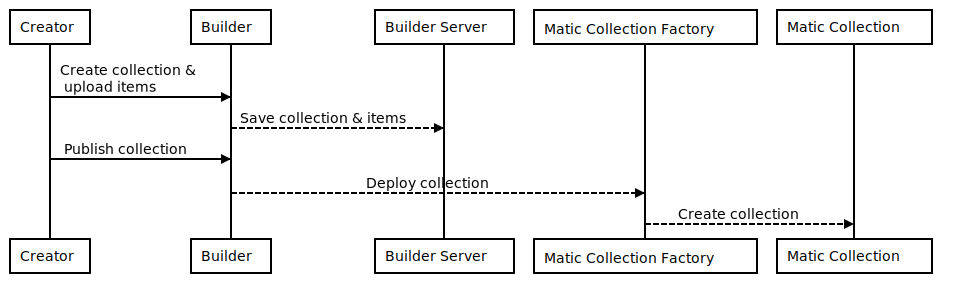
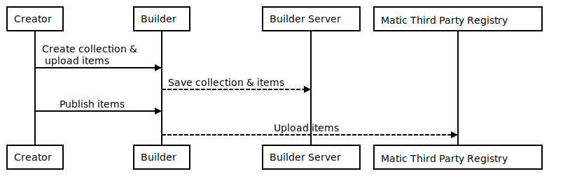
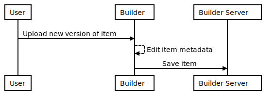
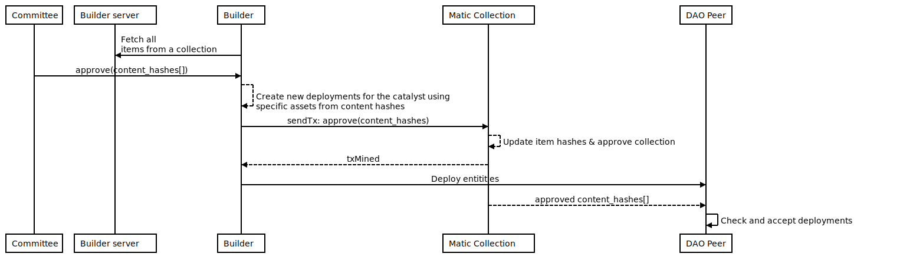
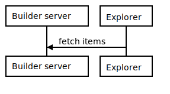
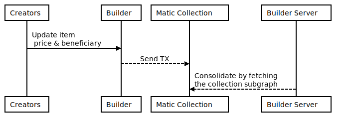
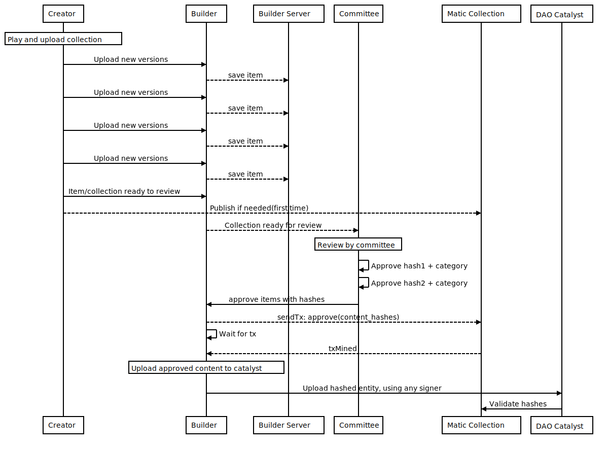

# Collection Items Approval Flow Enhancement

## Statement of the problem

The DAO Catalysts will now only accept deployments of approved collection entities, AND matching content hashes. Other deployments will fail.

### Consensus changes

The consensus rules of the catalyst will add a validation to the deployment of collection entities, that validation will now verify that:

- The entire collection is approved

- The hash of the deployed entity matches the approved hash on the blockchain

## Alternative A ✅

- Collections are uploaded as they are right now while they are not published.

- Once the collection is published, the creator can flag their collections as ready for review. Creators can still perform changes to the collection. Those changes will be stored in the builder-server. If any item of the collection has a change after it was approved. The collection & the item will be displayed as _dirty_. The creator can set the collection for review if any of the items is _dirty_.

- The collection smart contract won't suffer any changes. The committee members will use the `rescueItem` method to put the content hash of each item. For the time being the rescue method is only used to [revert an item to a previous version](https://github.com/decentraland/adr/blob/main/docs/ADR-32-wearable-committee-reverts.md)

- The committee contract will support calls in batch by the committee members:

  - The committee members will send a transaction using the methods `setApproved` & `rescuesItem`. These two actions will simulate an `approve(hash)`.

- Committee contract can aprove and rescue. Sends hash of what they saw, _`approve(hash)`_

  approves the collection and puts hashes to all items.

Check [here](https://github.com/decentraland/wearables-contracts/blob/master/Collections_V2_Actors.md) for further reference of smart contracts.

- The catalyst will accept entities where its collection and content hashes are approved. No matter who is submitting the entity. Changes will be needed [here](https://github.com/decentraland/catalyst/blob/3098701a42f0656dc595e653694abf4f7f418bee/content/src/service/access/AccessCheckerForWearables.ts#L119)

### Create a Decentraland collection

<!--
```sequence
participant Creator as C
participant Builder as B
participant Builder Server as PT
participant Matic Collection Factory as M
participant Matic Collection as MC

C-&gt;B: Create collection &amp;\n upload items
B--&gt;PT: Save collection &amp; items
C-&gt;B: Publish collection
B--&gt;M: Deploy collection
M--&gt;MC: Create collection
```
-->



### Create third party Item

<!--
```sequence
participant Creator as C
participant Builder as B
participant Builder Server as PT
participant Matic Third Party Registry as TPR

C-&gt;B: Create collection &amp;\n upload items
B--&gt;PT: Save collection &amp; items
C-&gt;B: Publish items
B--&gt;TPR: Upload items
```
-->



### Create and update items

<!--
```sequence
participant User as U
participant Builder as B
participant Builder Server as PT
U-&gt;B: Upload new version of item
B--&gt;B: Edit item metadata
B-&gt;PT: Save item
```
-->



### Propagate deployments to DAO Cataysts

<!--
```sequence
participant Committee as C
participant Builder server as PT
participant Builder as B
participant Matic Collection as M
participant DAO Peer as P
B-&gt;PT: Fetch all \nitems from a collection
C-&gt;B: approve(content_hashes[])
B--&gt;B: Create new deployments for the catalyst using\nspecific assets from content hashes
B-&gt;M: sendTx: approve(content_hashes)
M--&gt;M: Update item hashes &amp; approve collection
M--&gt;B: txMined
B-&gt;P: Deploy entitities
M--&gt;P: approved content_hashes[]
P-&gt;P: Check and accept deployments
```
-->



### Get (non-catalyst) content to test in-world

<!--
```sequence
participant Builder server as BS
participant Explorer as E
E-&gt;BS: fetch items
```
-->



### Change editable parameters from items (Decentraland Collections only)

_beneficiary, price, name, description, category, body shapes_.

<!--
```sequence
participant Creators as C
participant Builder as B
participant Matic Collection as M
participant Builder Server as BS
C-&gt;B: Update item\n price &amp; beneficiary
B--&gt;M: Send TX
BS--&gt;M: Consolidate by fetching\nthe collection subgraph
```
-->



### Approve process (committee)

<!--
```sequence
participant Creator as Ct
participant Builder as B
participant Builder Server as BS
participant Committee as C
participant Matic Collection as M
participant DAO Catalyst as peer
note over Ct: Play and upload collection
Ct-&gt;B: Upload new versions
B--&gt;BS: save item
Ct-&gt;B: Upload new versions
B--&gt;BS: save item
Ct-&gt;B: Upload new versions
B--&gt;BS: save item
Ct-&gt;B: Upload new versions
B--&gt;BS: save item
Ct-&gt;B: Item/collection ready to review
Ct--&gt;M: Publish if needed(first time)
B--&gt;C:Collection ready for review
note over C: Review by committee
C-&gt;C: Approve hash1 + category
C-&gt;C: Approve hash2 + category
C-&gt;B: approve items with hashes
B--&gt;M: sendTx: approve(content_hashes)
B-&gt;B: Wait for tx
M--&gt;B: txMined
note over B: Upload approved content to catalyst
B-&gt;peer: Upload hashed entity, using any signer
peer-&gt;M: Validate hashes
```
-->



## Alternative B

Using non-DAO catalyst with new flags to provide a decentralized way of storing the items instead of the builder-server.

This alternative is not needed for the time being cause the builder-server is already used when the collection items are not published yet.

## Participants

- @Mendez

- @Mati

- @Juanca

- @Nacho
