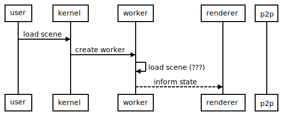

# Isolated mode 

## Context and Problem Statement

The project is growing with more features/systems and some of them may be not compatible together 
like for example builder and avatars moving through comns. Also, some scenes are starting 
to be perfomance-intensive. If the user want to give all the resources to a scene to speed it up, 
it should be able to do it. In order to try to tackle this problem, we need a way to disconnect
features/systems and scenes

## Considered options

- option 1: Isolated modes

We can implement the isolated modes, when kernel enter in this state, we can pass as a parameter the 
type of the isolated mode that we want, and kernel will disable all the features/systems or scenes necessary

This way we decouple the knowledge of the systems from the kernel and renderer and we only need to communicate
the mode that we want and kernel will do it

- option 2: Features/systems/scenes granular control

In this option, we create in kernel a custom way to disable features/systems and scenes.

This way the renderer can specify which systems/scenes should disable and kernel should act.

This way, we have a granular control in the renderer about what we want to enable/disable

- option 3: Control the systems from the renderer

We can also ignore the kernel features in the renderer and control everything from the renderer.

This way we don't need to develop anything additional, however, as the project increase in complexity we should
have it into consideration

## Decision

We went for the option 1: Isolated modes because this way kernel and the renderer will be decoupled and we
still can have control about the systems/scenes that are enabled/disabled

<!--
```sequence
participant Unity as R
participant Kernel as K
participant Scene worker as W

note over R: Start isolated mode
R->K: enter isolated mode(mode)
K-->K: Enable/disable required systems
K->R: Enable/disable required systems
K-->W: Create new worker (only if necessary)
K->R: LoadParcelScenes(sceneId) (only if necessary)
-->



## Use cases of Isolated mode

- Once active, the dynamic loading of scenes should be halted, and recovered once we finish the isolated scene mode.
- Isolated scenes can be started from builder in world, either from deployed scenes and from non-deployed scenes (without sceneId and using a manifest)
- Isolated scenes can be started from scenes directly, to shut down the neighboring scene loading. Useful in dungeons, closed buildings, etc.

## Status

Accepted

## Consequences

In order to implement this ADR we will develop a new message in kernel and the renderer to enable/disable the isolated mode
and implement it in the kernel starting with the builder isolated mode that will disable all the scenes and system and add a worker

## Participants

Date: 2021-12-03

- Adrian
- Agus Mendez
- Brian
