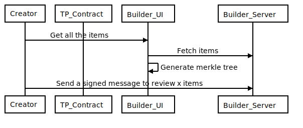
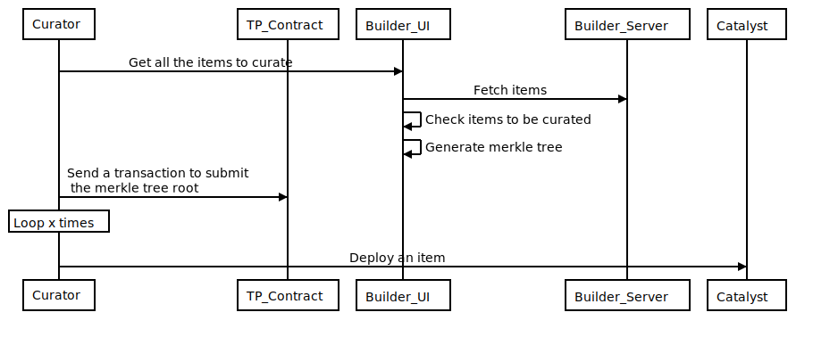
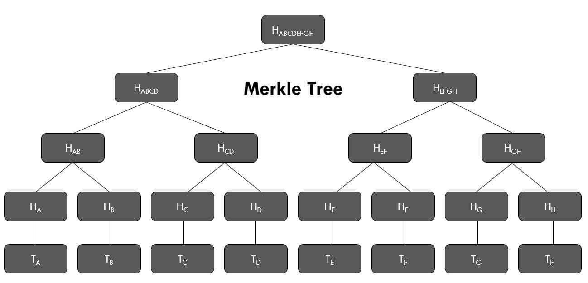

# Third Party Curation With Merkle Tree

## Statement of the problem

Third parties may want to add one item representation per NFT. Each item may need to be accepted by the Decentraland catalysts. For third parties with an small number of items, the current flow of the Decentraland collection where each items is submitted and curated by using the blockchain works but for projects with > 500 nfts (item representations) it does not scale. Having in mind the gas limit of each transaction, we can submit batches of 40-50 items. The third party manager and the curator will need to submit around 250 transactions each for a collection of 10k items. We need to find a way to optimize the managers and curators time while keeping the process trustless and with a good UX.

## Proposed solution

### Item creation



Items for third parties are going to be created as usual but they are not going to be uploaded to the blockchain (ThirdPartyRegistry smart contract). Third Party managers will need to sign a message every time they send items for review. This is the only blockchain related action needed for the item creation phase.

The main difference between the Decentraland collections is that the items and its metadata are not going to be submitted to the blockchain. We will rely on the third party API and the Decentraland catalysts.

Not submitting the items to the blockchain reduce the number of transactions for the third party manager to just a signature everytime an items needs to be reviewed. For Decentraland collection we require one transaction but if we need third parties to submit all of their items ids to the blockchain, it will require a lot of transactions limited by the gas cap of each block in the Polygon chain. E.g: 2k transactions for a collection with 100k items.

### Item curation

The current implementation of curating a Decentraland collection requires the curator to submit the content hash of each item to the blockchain so the [catalysts accept](./ADR-41-collection-items-approval-flow-enhancement.md) them. Like with the item creation, the transaction for submitting the content hash to the blockchain is limited by the gas cap of each block in the Polygon chain and around 2k transactions may be needed for collection with 100k items.



In order to do not depend on the amount of items and/or the block gas limit, the curation for third party collections will use a [merkle tree](https://www.forex.academy/understanding-merkle-tree-its-importance-in-blockchain/) where only the merkle root will be submitted to the blockchain.



#### Markle tree generation

The merkle tree will be generated by using all the items' urn and content hash. Once the merkle tree is created, the curator will submit the root of the tree to the blockchain. Generating the proof is an off-chain process, submitting the root of the tree needs just 1 transaction. Following the image above, what is going to be added to the blockchain is HABCDEFGH.

#### Merkle Tree validation

Every item deployment to the catalyst, will contain, along with the normal data, an index and proof. The proof is the path that the validation method needs in order to check whether the item’s urn and content hash is part of the tree or not. E.g: If we see TA as the content hash + urn of the item to be deployed, the index will be `0` and the proof: [HB, HCD, HEFGH]. The catalyst will process the data submitted and will get `HABCDEFGH` as the root. If that root is the same as the one in the blockchain then it can ensure that the deployment is valid.

Every time an item changes, the curator must submit the new root to the blockchain. This won’t break the entities synchronization because we will always check the root in the blockchain at a specific block number. Checking the data in a specific block is what we are currently doing and TheGraph supports it out of the box.

The entity metadata that will be stored in the Content Server will have a shape similar to:

```typescript
{
  …, // current metadata
  index: 15, // number
  proof: [ // Dynamic bytes array. log2 N \* 32bytes size with a complexity of O(log2 N). Where N is the number of items.
    "0xc8ae2407cffddd38e3bcb6c6f021c9e7ac21fcc60be44e76e4afcb34f637d562",
    "0x16123d205a70cdeff7643de64cdc69a0517335d9c843479e083fd444ea823172",
    "0x1fbe73f1e71f11fb4e88de5404f3177673bdfc89e93d9a496849b4ed32c9b04f",
    "0xed60c527e6774dbf6750f7e28dbf93c25a22660085f709c3a0a772606768fd91",
    "0x7aff1c982d6a98544c126a0676ac98102533072b6c4506f31b413757e38f4c30",
    "0x5f5170cdf5fdd7bb25c225d08b48361e41f05477880812f7f5954e75daa6c667",
    "0x08ae25d236fa4105b2c5136938bc42f55d339f8e4d9feb776799681b8a8a48e7",
    "0xadfcc425df780be50983856c7de4d405a3ec054b74020628a9d13fdbaff35df7",
    "0xda4ee1c4148a25eefbef12a92cc6a754c6312c1ff15c059f46e049ca4e5ca43b",
    "0x98c363c32c7b1d7914332efaa19ad2bee7e110d79d7690650dbe7ce8ba1002a2",
    "0x0bd810301fbafeb4848f7b60a378c9017a452286836d19a108812682edf8a12a",
    "0x1533c6b3879f90b92fc97ec9a1db86f201623481b1e0dc0eefa387584c5d93da",
    "0x31c2c3dbf88646a964edd88edb864b536182619a02905eaac2a00b0c5a6ae207",
    "0xc2088dbbecba4f7dd06c689b7c1a1e6a822d20d4665b2f9353715fc3a5f0d588",
    "0x9e191109e34d166ac72033dce274a82c488721a274087ae97b62c9a51944e86f",
    "0x5ff2905107fe4cce21c93504414d9548f311cd27efe5696c0e03acc059d2e445",
    "0x6c764a5d8ded16bf0b04028b5754afbd216b111fa0c9b10f2126ac2e9002e2fa"
  ]
}
```

Items rejection will be handle at the third party level for the time being. It means that if the entire third party will be set as rejected if any item needs a critical fix. Some ideas are being evaluated to make it more granular but they are not covered by this ADR.

### Item upload

The item upload will work the same as for the Decentraland collection.

## Participants

- @agusaldasoro
- @menduz
- @pentreathm
- @jmoguilevsky
- @guidota
- @lpetaccio
- @nsantangelo
- @nachomazzara
