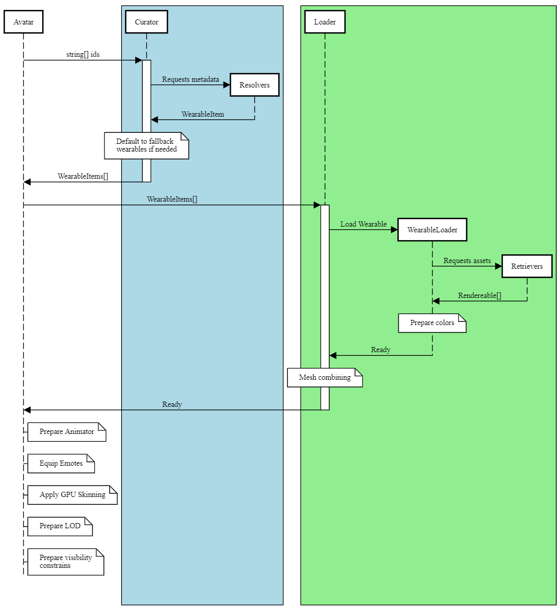

# ADR 65 Avatar System for Renderer (Unity)

## Problem Statement

Avatars are a key part of Decentraland, the system behind the curtains must be resilient, scalable and performant.

## Needs
For an avatar model (a set of wearable ids with color settings)
- Curate the ids. Filter non-valid IDs, resolve ids<>metadata, process hides/replaces lists, validate representations, fallback to default wearables...
- Load the assets for each wearable in an avatar. Cache and reuse them to avoid unnecessary requests and optimize memory usage.
- Fallback to default wearables in case of errors on loading.
- Merge everything into a single more performant mesh.
- Prepare the animator: GPU Skinning and Emotes.
- Prepare the LOD system.
- Handle the visibility in a simple way to avoid race conditions or multiple sources trying to show/hide the avatar.

## Glossary

- *Wearable*:  A collectable item that can be carried by an avatar such as cosmetics or emotes.
- *DataStore:* Containers for Data, accessible project-wide without business logic.
- *Required Part:* Parts of the avatar that must be rendered (unless hidden by a wearable): *Upper body, lower body, feet...*
- *BodyShape:* Any of the base skeletons available, at the moment we have ShapeA and ShapeB but it’s expected to be extended in the future with new types of bodies.
- *Representation:* Representation of the wearable for a specific *BodyShape*.
- *Facial Feature:* Wearables attached to the face such as *eyes, eyebrows* or *mouth*.
- *SSAO:* Super Sampling Ambient Occlusion, a postprocessing effect to simulate shadows due to occlusion.
- *Impostor:* 2D billboard simulating the player.

## Existent solution

Although it falls out of the scope of the ADR, it’s interesting to state the problems associated with our previous implementation to explicitly take them into consideration in the proposal. It consisted in a monolithic multipurpose class with few downsides:

- High maintenance cost.
- Prone to regressions.
- Hard to extend with new features.
- Highest tech-debt of the whole project.
- Performance pit-fall.

## Approach

DCL Avatar is an on-going system in constant evolution and needs to be as modular and clear as possible. The first step is to split the loading of an Avatar into different modules:

### Flow

Our starting point is an avatar profile, just a collection of *ids* without metadata and some color settings for skin and hair.

- Curating the profile: Transform *ids* into a readable avatar profile with metadata.
    - Resolve the set of *ids* into *Wearables* with metadata aka *WearableItem*.
    - Process the hides/replaces lists to avoid conflicts.
    - Remove wearables with no *representation* for the selected bodyshape.
    - Fallback to default wearables for not filled *required parts.*
- Loader: Retrieves the assets for the avatar
    - Download the bodyshape and wearables.
    - Set the skin/hair color
    - Download textures for *facial features*.
    - Set *facial features* colors (eyebrows/mouth/eyes tint).
    - A failure downloading a *bodyshape* abort the process
    - A failure downloading a *wearable* for a *required part*, will be defaulted.
        - Failure downloading a default wearable will abort the process.
    - Merge everything into a single mesh and output its rendereable (rather than a performance tweak, meringg all the wearables into a single mesh is now at the core of our avatar system due to incompatibilities with the shader).
- Animator: Set up and run animations/emotes
    - Prepare locomotion anims
    - Play emotes.
- Animation Equipper: Equips animations (emotes) and track their lifecycle.
    - Requests emotes to be downloaded.
    - Add them to the Animator
- Optimization Tweaks: Each tweak can a be a separated module, but for readability’s sake they will be gathered here.
    - GPU Skinning: Forward the skinning of an animation to a shader
- LOD: Define the state of the renderer based on the distance to the camera
    - Enable/disable specifics such as: *SSAO* or *facial features*
    - Enable/disable the *impostors*.
- Visibility: Set the visibility for the avatar.
    - Compound the final visibility.
        - Lot of systems modify the visibility of an avatar: being behind the camera, *AvatarModifierArea*, max avatars cap... this module avoid situations such as an avatar in a modifier area is set visible because it’s no longer behind the camera.



### Curator

Transform *ids* into a readable avatar profile with metadata.

<aside>
💡 All asynchronous methods are described as synchronous to reduce boilerplate and increase readability.

</aside>

- *IAvatarCurator*
```csharp
public interface IAvatarCurator : IDisposable
{
    (
        WearableItem bodyshape,
        WearableItem eyes,
        WearableItem eyebrows,
        WearableItem mouth,
        List<WearableItem> wearables,
        List<WearableItem> emotes
    ) Curate(AvatarSettings settings, IEnumerable<string> wearablesId);
}
```

Internally uses `IWearableItemResolver` to bring the metadata of a wearable based on its *id*.

- *IWearableItemResolver*
    
```csharp
public interface IWearableItemResolver : IDisposable
{
    (
        List<WearableItem> wearables,
        List<WearableItem> emotes
    ) ResolveAndSplit(IEnumerable<string> wearableIds);

    WearableItem[] Resolve(IEnumerable<string> wearableId);
    WearableItem Resolve(string wearableId);

    void Forget(List<string> wearableIds);
    void Forget(string wearableId);
}
```
    

### Loader

Receives a set of wearables with metadata and output a single *SkinnedMeshRenderer* with the combination of wearables and bodyshapes. At the moment *FacialFeatures* are handled separatedly.

```csharp
public interface ILoader : IDisposable
{
    public enum Status
    {
        Idle,
        Loading,
        Succeeded,
        Failed_Minor,
        Failed_Major
    }

    GameObject bodyshapeContainer { get; }
    SkinnedMeshRenderer combinedRenderer { get; }
    List<Renderer> facialFeaturesRenderers { get; }
    Status status { get; }

    void Load(WearableItem bodyshape, WearableItem eyes, WearableItem eyebrows, WearableItem mouth, List<WearableItem> wearables, AvatarSettings settings);
    Transform[] GetBones();
}
```

Loader makes usage of `IWearableLoader`, `IBodyshapeLoader` to download and prepare each wearable (included the bodyshape).

```csharp
public interface IWearableLoader : IDisposable
{
    public enum Status
    {
        Idle,
        Succeeded,
        Defaulted,
        Failed
    }

    WearableItem wearable { get; }
    Rendereable rendereable { get; }
    Status status { get; }
    void Load(GameObject container, AvatarSettings avatarSettings);
}
```

```csharp
public interface IBodyshapeLoader : IWearableLoader
{
    WearableItem eyes { get; }
    WearableItem eyebrows { get; }
    WearableItem mouth { get; }

    SkinnedMeshRenderer eyesRenderer { get; }
    SkinnedMeshRenderer eyebrowsRenderer { get; }
    SkinnedMeshRenderer mouthRenderer { get; }
    SkinnedMeshRenderer headRenderer { get; }
    SkinnedMeshRenderer feetRenderer { get; }
    SkinnedMeshRenderer upperBodyRenderer { get; }
    SkinnedMeshRenderer lowerBodyRenderer { get; }
    bool IsValid(WearableItem bodyshape, WearableItem eyebrows, WearableItem eyes, WearableItem mouth);
}
```

Internally both rely the heavy-lifting of downloading and retrieving the assets to `IWearableRetriever`.

```csharp
public interface IWearableRetriever : IDisposable
{
    Rendereable rendereable { get; }
    Rendereable Retrieve(GameObject container, ContentProvider contentProvider, string baseUrl, string mainFile);
}
```

In the case of the `BodyshapeLoader` we also have to get the facial features using `IFacialFeatureRetriever`. 

```csharp
public interface IFacialFeatureRetriever : IDisposable
{
    (Texture main, Texture mask) Retrieve(WearableItem facialFeature, string bodyshapeId);
}
```

Once every the bodyshape and every wearable is downloaded and the colors for hair and skin are set, we merge them into a single multimaterial mesh. There’s an in-depth post about that herer [https://decentraland.org/blog/project-updates/100-avatars-in-a-browser-tab/](https://decentraland.org/blog/project-updates/100-avatars-in-a-browser-tab/). 

The merge of the avatar is done by an `IAvatarMeshCombinerHelper`.

```csharp
public interface IAvatarMeshCombinerHelper : IDisposable
{
    public bool useCullOpaqueHeuristic { get; set; }
    public bool prepareMeshForGpuSkinning { get; set; }
    public bool uploadMeshToGpu { get; set; }
    public bool enableCombinedMesh { get; set; }

    public GameObject container { get; }
    public SkinnedMeshRenderer renderer { get; }

    public bool Combine(SkinnedMeshRenderer bonesContainer, SkinnedMeshRenderer[] renderersToCombine);
    public bool Combine(SkinnedMeshRenderer bonesContainer, SkinnedMeshRenderer[] renderersToCombine, Material materialAsset);
}
```

### Animator

At this point we have a fully loaded avatar combined in a single mesh. The next step is to prepare it for animations. `IAnimator` takes care of that:

```csharp
public interface IAnimator
{
    bool Prepare(string bodyshapeId, GameObject container);
    void PlayEmote(string emoteId, long timestamps);
    void EquipEmote(string emoteId, AnimationClip clip);
    void UnequipEmote(string emoteId);
}
```

`IAnimator.Prepare` will set up the locomotion animations and create the needed components by Unity in the root of the avatar hierarchy.

### EmotesEquipper

The equipped emotes will be received with the rest of wearables in the user profile. Once they are identified (by the `AvataCurator`) a whole process to download and process the animations is required.

Requesting, retrieving, caching and processing animations is not trivial and it's explained on its own [ADR](ADR-66-emotes-system-for-renderer.md).

To summarize it: `IEmoteAnimationEquipper` will take care of requesting an emote animation and wait until it’s ready to equip it in the `IAnimator`.

```csharp
public interface IEmoteAnimationEquipper : IDisposable
{
    void SetEquippedEmotes( string bodyShapeId, IEnumerable<WearableItem> emotes);
}
```

### GPU Skinning

GPU Skinning is part of our optimization tweaks. It composes the transformation matrix for each bone in an animation and forward them to the shader to relocate every pixel.

```csharp
public interface IGPUSkinning
{
    Renderer renderer { get; }
    void Prepare(SkinnedMeshRenderer skr, bool encodeBindPoses = false);
    void Update();
}
```

It also contains a throttler which spread the update between frames for avatars further away:

```csharp
public interface IGPUSkinningThrottler : IDisposable
{
    void Bind(IGPUSkinning gpuSkinning);
    void SetThrottling(int framesBetweenUpdates);
    void Start();
    void Stop();
}
```

### LOD

The LOD system allows disabling expensive rendering features based on distance. At the moment three levels have been implemented:

*LOD0*: Fully 3D Avatar.

*LOD1*: Fully 3D Avatar without *SSAO* and *FacialFeatures*.

LOD2: A billboard *impostor* with a texture of the body on top.

```csharp
public interface ILOD : IDisposable
{
    int lodIndex { get; }
    void Bind(Renderer combinedAvatar);
    void SetLodIndex(int lodIndex, bool inmediate = false);
    void SetImpostorTexture(Texture2D texture);
    void SetImpostorTint(Color color);
}
```

`LOD` will also make use of the visibility handler (see below) to hide different parts of the avatar.

### Visibility

The final step of the loading process is to visibility handler, it’s not as easy as just turning on/off the avatar. Multiple systems have different reasons to hide or show an avatar and usually conflict with one another. An avatar can be hidden because it’s behind the camera, inside an `AvatarModifierArea` or because the max budget for avatars has been reached...

To avoid these conflicts a visibility constrains system has been implemented.

```csharp
public interface IVisibility : IDisposable
{
    void Bind(Renderer combinedRenderer, List<Renderer> facialFeatures);

    void AddGlobalConstrain(string key);
    void RemoveGlobalConstrain(string key);

    void AddCombinedRendererConstrain(string key);
    void RemoveCombinedRendererConstrain(string key);

    void AddFacialFeaturesConstrain(string key);
    void RemoveFacialFeaturesConstrain(string key);
}
```

The Avatar itself wont be rendered if any *global* or *CombinedRenderer* constrain exists.

The *FacialFeatures* wont be rendered if any *global* or *FacialFeature* constrain exists.

i.e. A constrain `own_player_invisible` will be added when toggling between 1st and 3rd person camera.

## Tests suite

The test suite is fairly simple compared to the complexity of the avatar system. Every dependency is injected in the constructor and based on an interface. This pattern called `DependencyInjection` allow isolation of every subsystem by mocking its dependencies using any of the mocking frameworks available (in our case `NSubstitute`).

i.e.

```csharp
public class EmoteAnimationEquipperShould
{
    private EmoteAnimationEquipper equipper;
    private IAnimator animator;

    [SetUp]
    public void SetUp()
    {
        animator = Substitute.For<IAnimator>();
        equipper = new EmoteAnimationEquipper(animator);
    }

    [Test]
    public void AssignReferencesOnConstruction()
    {
        Assert.AreEqual(animator, equipper.animator);
        Assert.AreEqual(0, equipper.emotes.Count);
    }
}
```

## Benefits

- Modularized: Every responsibility of the loading process is a separated module completly decoupled from the rest. It directly impact in the time required to find and fix bugs, maintain and scale each module.
- Mockable: Test suite is more reliable, every aspect of the process can be tested without requiring visual tests.
- Adaptability: Implementing new ways of loading and rendering avatars it’s easier. i.e. a LOD system with more than 3 levels can be implemented in Desktop without altering any other module.

## Competition

No alternatives have been consider.

The new avatar system follows the conventions of the team and uses best practices in the industry (such as DI, mockability and AAA paradigm in tests).