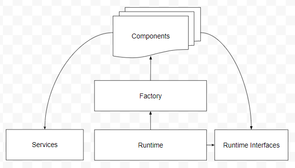
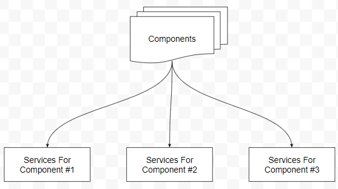
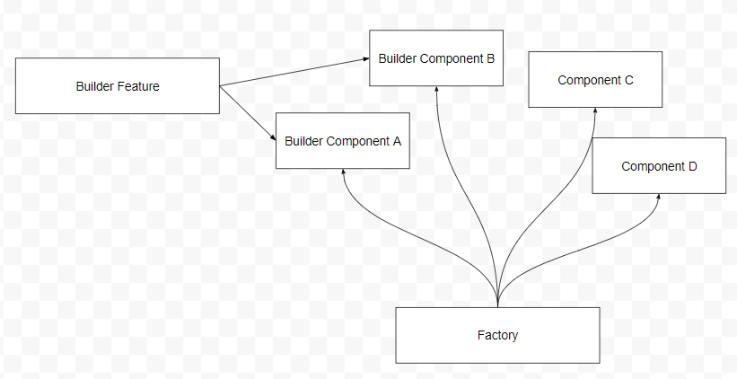
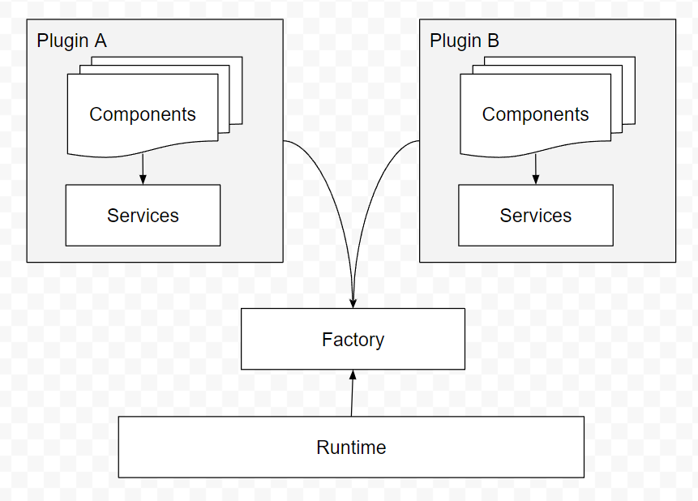
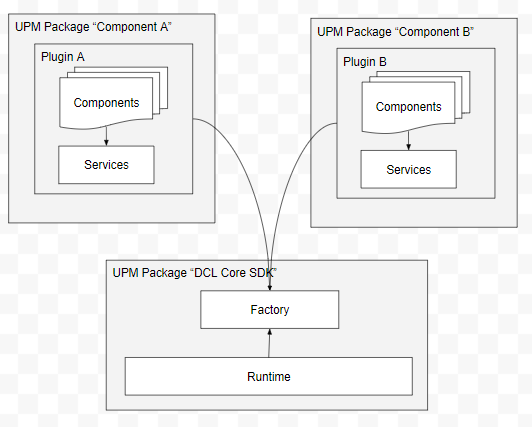

# ADR 67: Runtime Architecture For Renderer

## Problem Statement

The world runtime is a collection of services that should allow the following:

- Proper representation of the ECS model to use by the Renderer services.
- Message enqueuing and processing of messages that come from each scene.
- Translation of messages into the proper modifications of the ECS model.
- Any core systems that need to exist to ensure a performant execution of the messages and are considered for common use cases of any component.

On top of that, there are a variable number of components that make use of the core systems to keep the world running. When expanding the SDK, the main activity involved is to add new component implementations on top of the runtime. 

This is how the dependency relationships of the runtime worked until now:

The Factory references all the components and explicitily register the builder methods for them in its constructor. Then each component has its own implementation, but it has to reference the runtime interfaces and not the runtime itself, to solve a cyclic references issue.

If the component need a specialized service, this service must reside on the runtime or application (global) level.

### Problem #0: This design has anti-patterns

A known anti-pattern is that lower level systems can’t have knowledge about higher level ones. Here, the runtime has knowledge about the components. Components are just high level implementations put on top of the SDK.

On the long run, this design invariabily lead to too many services on the global scope.

These anti-patterns lead to other more specific problems described below.

### Problem #1: Components lacking a domain lifecycle

If a group of closely related components needed a specialized service, this service had to be put into the global scope. When many components are implemented, this makes the code hard to maintain to new contributors because a lot of services start to reside in the global scope, like this:

On top of this, these services have to be implemented as Singletons or be created and destroyed as part of the global scope of the application. So, when implementing a new component, the contributor has to modify code related with the entry point of the whole application, instead of having a easier to understand construct, like a plugin.

A clear example of this are the `NFTShape` and `UUIDComponent` related components, each of those need shared instances of specific services between all the component instances. These shared instances need to have a clear lifecycle that’s related with the existence of the component. With no clear construct to allow for this, singletons were used. 

### Problem #2: External features that need components

The previous problem covered different components that need services, this problem is about the opposite: A specific service or feature that needs specific components.

This use case is very clear in the Builder feature:

Note that in this case, the only way the Builder feature has to add new components to the system is to modify the Factory implementation by adding the new components to it. For this to happen, Factory has to reference the new components. So now, all the components coming from different domains are muddled into the same class, and the Factory has to reference everything.

### Problem #3: Cyclic reference issues

If any component need something from the runtime, its forced to reference only interfaces to avoid cyclical dependencies. This is technically correct and complies to SOLID, however it may also lead to over-engineering and assembly segregation. 

Cyclical dependencies are a problem that may be hard to fix to someone not very familiar with the codebase and its an issue that should be avoided with a good design.

### Problem #4: Easy to come up with component-specific hacks

As the runtime is referencing the components, is very easy to make conditional type-checks and more code smell as the project grows up. This leads to high maintenance costs over time.

## Approach

The approach is to put the components inside of plugins. Each component is registered to the Factory at the plugin level, this registration tied to the plugin lifecycle.

If a component group has a need for a specialized service, this service is put inside the plugin as well.

In this approach, the runtime doesn’t know the components directly and will use the Factory to create them as it should. Services don’t have to be on the application scope. Now, components can reference the runtime if they need something from it. Refering to interfaces is recommended, but they don’t have to be in another assembly, so assemblies can start to be merged to avoid maintenance costs. 

Having to reference lots of assemblies can be painful, and a high number of assemblies has negative impact on compilation times and project updating in general due to high I/O costs.

## Benefits

Aside of solving the needs, this approach paves the way of segregating the component implementations into UPM packages, like this:

This allows easier external contributions, and in fact allow easier segregation of teams according to [Conway’s Law](https://en.wikipedia.org/wiki/Conway%27s_law). This works in tandem with the inminent scaling of the decentraland contribution efforts. 

## Competition

No competitions are considered in this document.

## Participants

- Brian Amadori