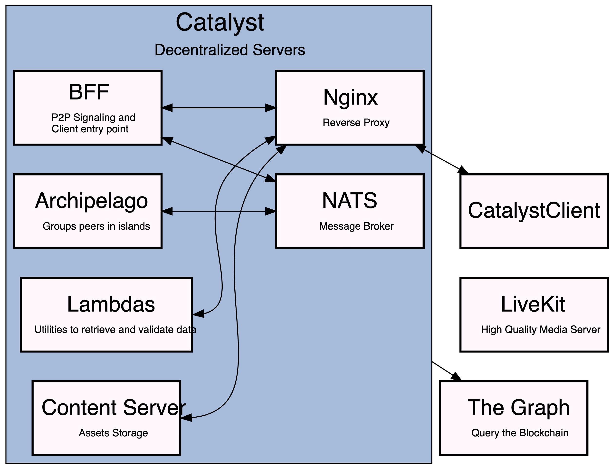

# Catalyst: New Communications Architecture

## Context and Problem Statement

The Communication Service, also known as [Lighthouse](https://github.com/decentraland/lighthouse), is in charge of orchestrating the P2P networks between users connected to Decentraland. It needs to determine which are the candidates for a P2P connection and do the WebRTC signaling to establish the connection. 

The number of WebRTC Connections that can be handled by a Web Browser is pretty small, between 4 to 6 connections. Users connected to Decentraland are grouped in islands of up to a 100 Peers. This means that there will always be many indirect connections or jumps between different pairs of peers in an island. This architecture, while cheap as everything happens P2P, has a high latency and low throughput when connected with a crowd, limiting the type and quality of experiences that the platform can provide. 

## Proposed solution

The idea of this new version of the Communication Services is to leverage the concept of an island as a unit, and be able to define specific communication **Transports** based on the coordinates of the islands using settings on the [Archipelago Service](https://github.com/decentraland/archipelago-service). By doing so, high-performance services can be deployed to provide better experiences in different scenes or events, and these services can be horizontally scale if needed. The current P2P model will keep existing and serving the rest of the world and the new transport abstraction will enable the architecture extensibility, allowing different researches and quick implementations to keep improving the communications services. 

Initially three types of transport will be supported:

- [LiveKit](https://livekit.io/): WebRTC, high-quality, low latency, needs extra infrastructure to scale.
- WebSocket: WS, simple to implement and extend, higher latency than webRTC alternatives, needs extra infrastructure to scale.
- Peer-to-Peer: WebRTC, no extra infrastructure needed to scale, latency increases as more peers are added to an island.

With regards to DCL platform alone (that is, without third-party servers), users mostly need to receive information from peers on the same island, so the transports will be in charge of broadcasting information between peers on a given island. 

### Comms Implementation 

The new implementation will replace the old [Lighthouse](https://github.com/decentraland/lighthouse) with a set of services as shown in the following diagram:

#### Backend for Frontend ([BFF](https://github.com/decentraland/sdk/issues/180))
This service is being created to resolve client needs in order to enable faster development of new features without breaking the existing APIs. In the context of the new communication services it will be in charge of managing the P2P signaling and thus replacing the [Lighthouse](https://github.com/decentraland/lighthouse). 

#### [Archipelago Service](https://github.com/decentraland/archipelago-service)

Previously Archipelago was a library used by the Lighthouse, as now it needs to work with the different transports beyond P2P, it was converted into a Service. This service will have the same responsibility that the library did: group peers in clusters so they can communicate efficiently. On the other hand, the service will also need to be able to balance islands using the available transports and following a set of [Catalyst Owner](https://github.com/decentraland/catalyst-owner) defined rules, in order to, for example, use LiveKit for an island in the Casino and P2P in a Plaza.

#### [NATS](https://nats.io/)

NATS is a message broker that enables the date exchange and communication between services. This is also a building block for future developments and will enable an easy way to connect services using subject-based messaging. In the context of this new architecture it will be used to communicate the BFF, Archipelago and LiveKit. 

#### [LiveKit](https://livekit.io/)

LiveKit is an open source project that provides scalable, multi-user conferencing over WebRTC. Instead of doing a P2P network, peers are connected to a Selective Forwarding Unit (SFU) in charge of managing message rely and different quality aspects of the communication. This will be the added infrastructure in order to provide high-performance/high-quality communications between crowds on designated scenes. 

More details on how the communications between services are done are explained [here](https://github.com/decentraland/comms-v3/blob/main/docs/comms.md).

## Status

In Progress

## Consequences 

- This architecture enables Catalyst Owners to add more infrastructure in order provide better experiences in designated scenes. 
- The infra can be spin up and horizontally scale to better support big events 
- The existing P2P model will keep existing as it is 
- Having Servers that can provide low-latency/high-throughput exchange of messages between peers will open the door for new gaming experiences implementations.
- The transport abstraction enables the extensibility of the architecture, having an easy way to test different SFUs or communication protocols to extend this functionality   

## Participants

@hugoArregui
@juancito.eth
@menduz
@pentreathm

