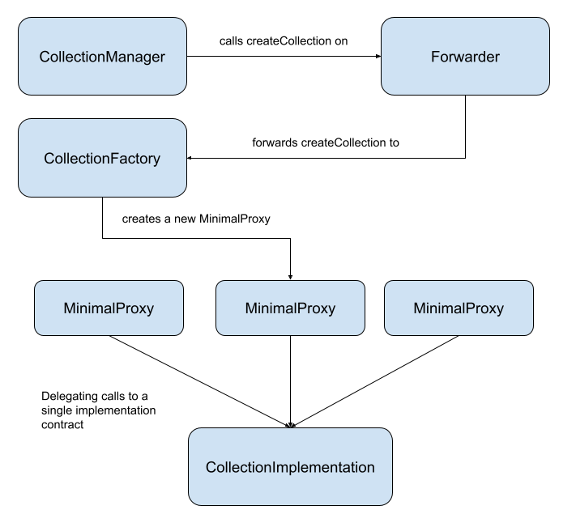
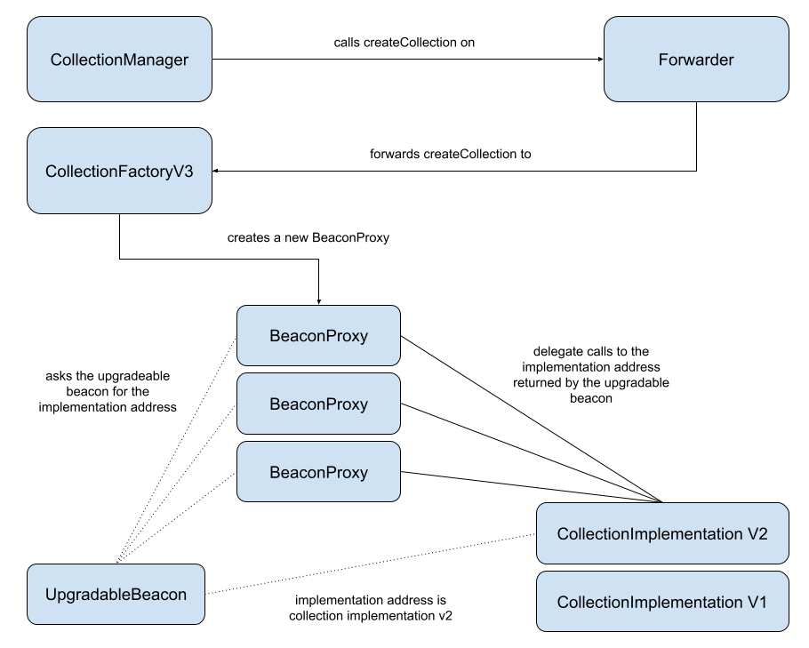

# Upgradable Collections

## Context



This diagram shows the current flow regarding publishing collections on the blockchain. 

The [CollectionManager](https://polygonscan.com/address/0x9D32AaC179153A991e832550d9F96441Ea27763A) has a `createCollection` external function called by the creator of a collection which receives both the address of the [Forwarder](https://polygonscan.com/address/0xBF6755A83C0dCDBB2933A96EA778E00b717d7004) and the [CollectionFactory](https://polygonscan.com/address/0xB549B2442b2BD0a53795BC5cDcBFE0cAF7ACA9f8)

Inside this function, the Forwarder calls another `createCollection` function the CollectionFactory contract.

This creates a new collection in the blockchain in the form of a [MinimalProxy](https://eips.ethereum.org/EIPS/eip-1167), which delegates all calls made to it to the [CollectionImplementation](https://polygonscan.com/address/0x006080C6061C4aF79b39Da0842a3a22A7b3f185e) contract containing the logic of how collections should behave.

Without this pattern, every time a collection is created, a new CollectionImplementation contract would have to be deployed. And this contract is BIG, costing a lot of gas in the process.

Thanks to how the EVM handles storage, These proxies can delegate calls to a contract containing the behavior, but updating only their own state.

## Problem

Let's say a vulnerability is found in the CollectionImplementation contract, or a new magical feature for collections is voted by the community to be added.

With this current implementation, sadly, there is absolutely nothing we can do. The proxies delegate calls to the implementation contract directly, and that does not allow any kind of modification or upgrade to the collection behavior.

## Solution



This solution implements the [Beacon](https://docs.openzeppelin.com/contracts/3.x/api/proxy#beacon) pattern.

Instead of creating minimal proxies delegating calls directly to the implementation, [BeaconProxies](https://docs.openzeppelin.com/contracts/3.x/api/proxy#BeaconProxy) are created.

These proxies know about an [UpgradeableBeacon](https://docs.openzeppelin.com/contracts/3.x/api/proxy#UpgradeableBeacon) which is in charge of storing the address of the implementation contract. The proxy asks for this implementation address before delegating the call to that contract.

The owner of the UpgradableBeacon can then update the implementation contract address with another one in order to update the behavior of the proxies, or fix vulnerabilities.

## Important

This solution is not retroactive. Collections/Proxies created as MinimalProxies will not obtain upgradable capabilities. Only collections created as BeaconProxies will gain these capabilities.

When updating the implementation contract in the UpgradableBeacon, it is vital that no contract state variables are removed or reordered. Doing so will certainly break things up.

For example, out first implementation has the following variables:

```
uint256 counter;
bool initialized;
bytes fingerprint;
```

The new implementation must have include these variables in the same order even if any of those variables is not used anymore. Any new variable must be defined at the end.

```
// old variables
uint256 counter;
bool initialized;
bytes fingerprint;

// new variables
uint256 newCoolCounter;
bytes newFingerprint;
```

More info about this [here](https://docs.openzeppelin.com/upgrades-plugins/1.x/writing-upgradeable#modifying-your-contracts).

## Status

Already being used in Polygon Mainnet.

Main contracts for this solution are:

- [CollectionFactoryV3](https://polygonscan.com/address/0x3195e88aE10704b359764CB38e429D24f1c2f781)
- [UpgradableBeacon](https://polygonscan.com/address/0xDDb3781Fff645325C8896AA1F067bAa381607ecc)

## Participants

- @fzavalia
- @nachomazzara
