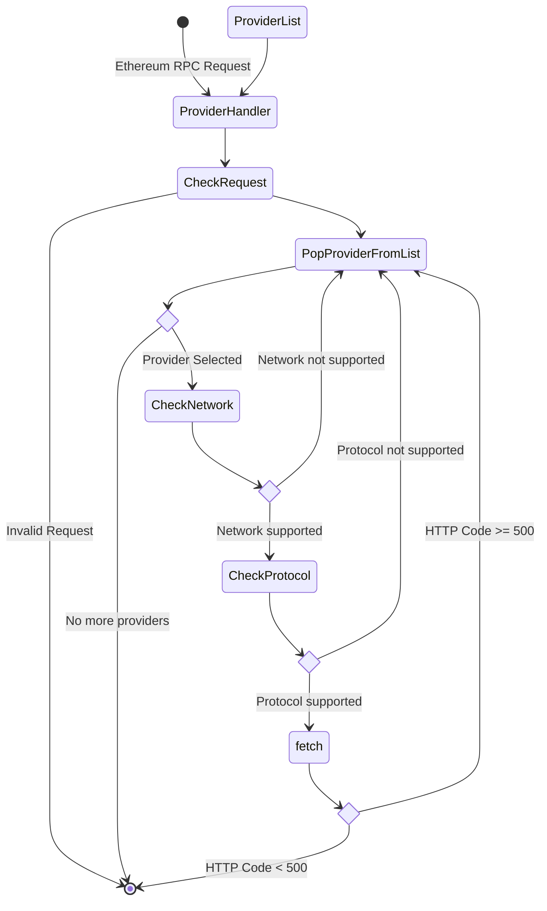

# Ethereum API providers

## Context and Problem Statement

Some of our services depend on a ethereum/polygon rpc provider, including wallet connect and catalyst, this dependency generates a single point of failure where any downtime of this provider is a downtime in our services. In order to make our system more resilient we need a way to distribute this charge over multiples provider and fallback any request those service that are down to other that is not

## Proposed solution

We proposed a Cloudflare worker that ack as a load balancer between any provider we chose

### Pros

- Single deploy solution: any change can be deploy to all service at the same time
- Single implementation solution: preventing bugs from differences between environments
- Keeps provider's key as secret
- Allow us to precisely control what can be done with our services
- Allow us to precisely monitor each provider
- An estimated non-significative cost increase

### Con

- Additional infra-structure to maintain
- We will move our Single point of failure from our providers to Cloudflare

## Load Balancer Algorithm

1. Ethereum RPC Request reach the Worker
2. Create a new instance of `ProviderHandler`
3. Validate the Request (if it is invalid returns `400`)
4. Randomly selected a Provider (if there is no more providers returns `503`)
5. Check if the Provider supports the network (if not go to step `4`)
6. Check if the Provider supports the protocol (http or ws, if not go to step `4`)
7. Forward request to the provider
8. Check response status code (if greater or equalt to `500` go to step `4`)
9. Forward response to the user



### Implementation API

`ProtocolUpgrade` defines if a request should be done over https or should be upgraded to websocket

```ts
export enum ProtocolUpgrade {
  https = 'https',
  websocket = 'websocket',
}
```

`Network` defines the target network

```ts
export enum Network {
  mainnet = 'mainnet',
  ropsten = 'ropsten',
  goerli = 'goerli',
  rinkeby = 'rinkeby',
  kovan = 'kovan',
  polygon = 'polygon',
  mumbai = 'mumbai',
}
```

`Provider` is the interface that needs to be implemented once per ethereum provider

```ts
export type ProviderURLOptions = {
  upgrade: ProtocolUpgrade
  network: Network
}

export interface Provider {
  /**
   * resolves the url to be fetched, if the network
   * or the protocol is not supported by the provider
   * should return `null`
   */
  getTargetUrl(options: ProviderURLOptions): string | null;
}
```

`ProviderHandler` handle a request and returns the response of the provider if the provider responds with a server error it's retry the request with a different provider if all providers fails responds with and error

```ts
export default class ProviderHandler {

  constructor(private providers: Provider[] = []) { }

  /**
   * Add a new provider
   */
  add(provider: Provider) {
    this.providers.push(provider)
    return this
  }

  /**
   * Check if the a request should be upgraded to websocket
   */
  getProtocol(request: Request): ProtocolUpgrade | null;

  /**
   * Check the network at witch the current request is trying to reach
   */
  getNetwork(request: Request): Network | null;

  /**
   * Retuers a response with custom CORS
   */
  cors = async (request: Request): Promise<Response> => {
    return new Response(null, {
      status: 204,
      headers: {
        // ADD CORS HEADERS
      }
    })
  }

  handle = async (request: Request, event: FetchEvent): Promise<Response> => {
    const method = request.method.toLowerCase()

    if (method === 'options') {
      return this.cors(request)
    }

    const upgrade = this.getProtocol(request)
    if (method === 'get' && upgrade !== ProtocolUpgrade.websocket) {
      return new Response(`Upgrade Required`, { status: 426 })
    }

    const network = this.getNetwork(request)
    if (!network) {
      return new Response('Unsupported network', { status: 404 })
    }

    const providers = shuffle(this.providers)
    for (const provider of providers) {
      const target = provider.getTargetUrl({ network, upgrade })
      if (target) {
        const response = await fetch(target, request)

        if (response.status >= 500) {
          console.error(`Error calling ${new URL(request.url).host}: ${response.status} ${response.statusText}`)
        } else {
          // do not modify request for websocket
          return response
        }
      }
    }

    return new Response('Providers unavailable', { status: 503 })
  }
}
```

## Participants

- @2fd
- @menduz
- @nachomazzara
