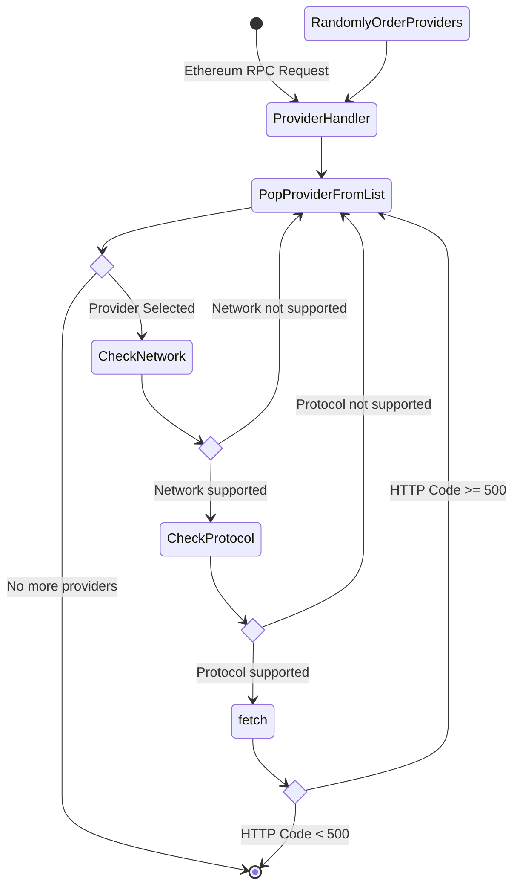

# Ethereum API providers

## Context and Problem Statement

Some of our services depend on a ethereum/polygon rpc provider, including wallet connect and catalyst, this dependency generates a single point of failure where any downtime of this provider is a downtime in our services. In order to make our system more resilient we need a way to distribute this charge over multiples provider and fallback any request those service that are down to other that is not

## Proposed solution

We proposed a Cloudflare worker that ack as a load balancer between any provider we chose

### Pros

- Single deploy solution: any change can be deploy to all service at the same time
- Single implementation solution: preventing bugs from differences between environments
- Keeps provider's key as secret
- Allow us to precisely control what can be done with our services
- Allow us to precisely monitor each provider
- An estimated non-significative cost increase

### Con

- Additional infra-structure to maintain
- We will move our Single point of failure from our providers to Cloudflare

## Load Balancer Algorithm

## Participants

- @nacho
- @menduz
