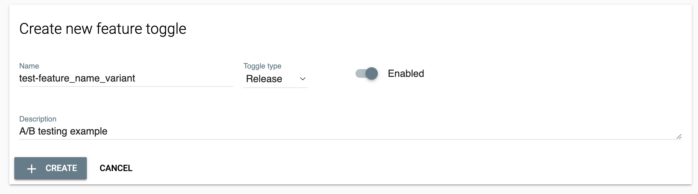
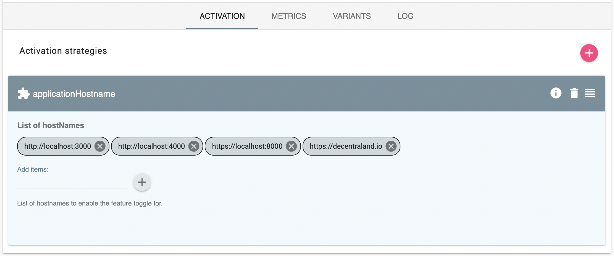
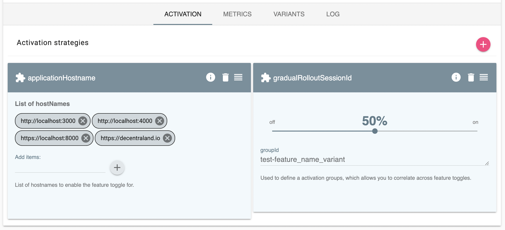
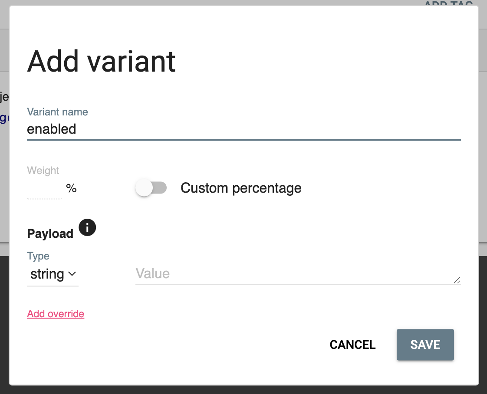
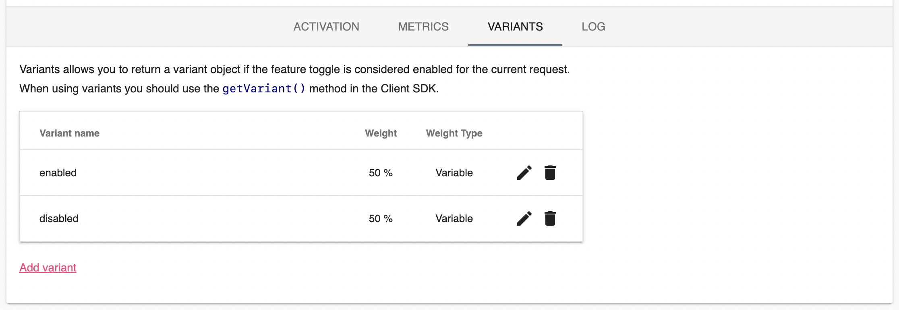
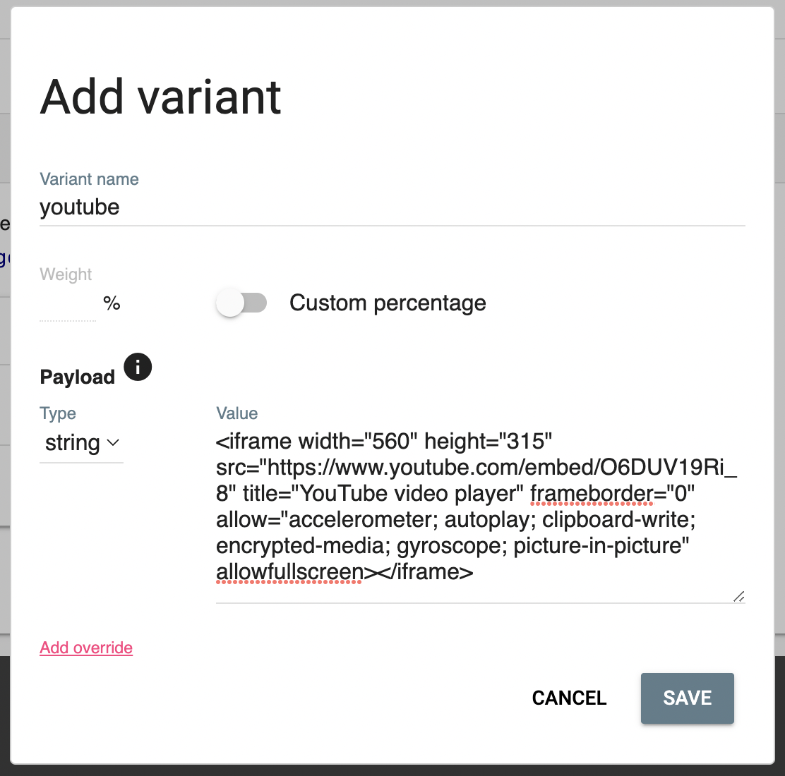

# A/B testing

## Context and Problem Statement

Given the number of new features we have, we need a way to measure the impact that each one has on the use of our products. A/B testing is what we use to decide between two or more versions of a new feature and/or to compare it with the current one. This ADR describes how we measure A/B testings in our products.

## Main objectives

- sanitize metrics
- allow data team to develop, monitor, and improve dashboards and tools decoupled from the implementation on each app
- allow any team to implement a/b testings on their environment without dependencies with other teams
- leverage over already implemented and tested tools

## Current implementation

To setup an A/B testing we use Feature Flags as assignation tool and Segment as measurement tool.

### Feature Flags: Setting up a new A/B testing

On this standard, an A/B is defined as a feature flag that ends with `_variant` with each of the possible variants defined as variant and the activation defined as your application required.

> Please note that if you need to test a new variant against the current one it is preferable to use a variant with two options (`enabled` and `disabled`) instead of the activation because otherwise, you won't be able to differentiate (and measure) when your a/b is active or just should show the current version.

#### Creating a new flag

Just create a new feature that ends `_variant`



#### Defining your activation

You can define your activation as your project needs, but in most of the cases you will need one of this two options:

- activation by host: `applicationHostname`
- activation rollout session: `gradualRolloutSessionId`

`applicationHostname` allows you to keep your test active on any testing environment and when its active on production



If you also add `gradualRolloutSessionId` you can rollout your test gradually



#### Defining your variants

In the `VARIANT` tab you can define as many cases as you need and control the percentage of users that will get each variant.





> Please note that if you define and activation with rollout and `enabled`/`disabled` variants you will split your users as follow:
>
> - assuming total: `1.000` users
> - activation rollout (50%): `500` users
> - `enabled` variant (50%): `250` users
> - `disabled` variant (50%): `250` users
>
> For a total of `1.000` only half of them will count as testing users and half of those will see the `enabled` options, that means that `750` users will see the old version but only `250` will be considered in the result of the A/B testing.
> If your objective is to test `500` users with `enabled` and `500` users with `disabled` remove the rollout configuration.

Once your A/B testing is ready you should get something like this:

```json5
{
  "flags": {
    "test-flag": true, // not an A/B testing
    "test-test-feature_name_variant": true,
  },
  "variants": {
    "test-feature_name_variant": {
      "name": "enabled" // or "disabled"
    }
  }
}
```

If instead your A/B testing is inactive you should get something like this:

```json5
{
  "flags": {
    "test-flag": true, // not an A/B testing
  },
  "variants": {}
}
```

#### Including extra data

Some times you need to include additional data to know how to handle each variant, this is useful because you can develop the variant implementation and detached from the end value (that can be content that is not ready jet) you will be able to develop and deploy you a/b testing and other teams in charge of produce the content will be able to test it without any other interaction with your code.



### Segment: measuring your new A/B testing

To measure if any of the variants of an A/B testing is significant we need to know three things:

- the total number of users in the A/B testing
- which variant got each one
- the success metric

To know the total number of users we send an event `feature_flags` each time a user gets a new set of feature flags, but to know which variant each user gets we need to format our feature flags as the following array:

```js
[
  `${FEATURE_FLAG_NAME}`,
  `${FEATURE_FLAG_NAME}:${FEATURE_FLAG_VARIANT_NAME}`,
]
```

For example, the previous feature flags will be format as:

```json5
[
  "test-flag", // not an A/B testing
  "test-feature_name_variant",
  "test-feature_name_variant:enabled",
  // or "test-feature_name_variant:disabled",
]
```

And send it in the prop `featureFlags` this way we can easy search feature flags and or variant.

```ts
analytics.track(
  `feature_flags`,
  {
    featureFlags: [
      "test-flag", // not an A/B testing
      "test-feature_name_variant",
      "test-feature_name_variant:enabled",
    ]
  }
)
```

Finally, you define your success metric (and time frame), this way the data team (or any other) will be able to generate a dashboard to measure the success (or not) of your test.
